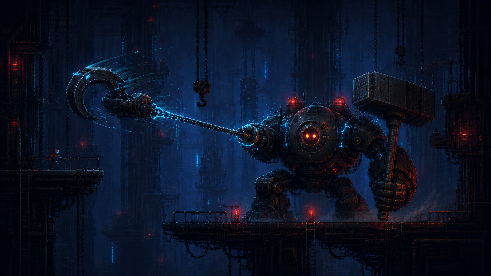
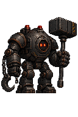

# BOSS03 LOWER SECTOR COMMANDER 이미지 생성 기획

> 상태: **REFERENCE-ONLY / 주 시각 콘셉트·본체 기본 스프라이트 승인**
>
> 범위: 아래 이미지는 사용자 제공 주 콘셉트다. Boss03 재도입, Runtime 스프라이트, Arena geometry, Collision, Rope Anchor 또는 공격 판정의 근거가 아니며, 전투 규칙은 [Commander 참고 계약](./LOWER-SECTOR-COMMANDER-REFERENCE-CONTRACT.md)이 소유한다.

> 출처: 사용자 제공·승인 · `1672×941px` RGB PNG · SHA-256 `347A8FB97BE3FAB19BEFDA853DD6EC19EEBBCD47B97EDD0D6185B237E43854A7` · Runtime 사용권·투명 alpha·충돌 정보는 주장하지 않는다.

> 본체 기준: [그래픽 원본 README](../../../assets/artwork/characters/boss03-lower-sector-commander/README.md) · 사용자 선택 원본을 `128×192px` RGBA로 정규화한 검토 export · 한 프레임만 승인했으며 Runtime-ready를 뜻하지 않는다.

| # | 점검 요소 | AS-IS | TO-BE / 판정 |
| ---: | --- | --- | --- |
| 1 | 기준 위계 | 장면 콘셉트와 단독 본체 이미지의 역할이 같지 않다. | 장면 이미지는 세계관·크기 대비, 위 본체 이미지는 캐릭터 외형을 소유한다. 서로 Arena·Collision을 정하지 않는다. **통과** |
| 2 | 본체 실루엣 | 수평 드론형 또는 작은 인간형 메카로 흐를 수 있었다. | 둥근 장갑 본체·낮은 센서 헤드·넓은 어깨·짧고 굵은 두 다리·넓은 발의 중량형 2족 보행기로 승인했다. **통과** |
| 3 | 얼굴·팔레트 | 사람 얼굴·조종석·전면 네온으로 보일 수 있었다. | 검은 원형 판의 두 적·주황 센서와 먹색 강철·녹슨 철색·수리 패치만 유지한다. **통과** |
| 4 | 사슬 훅 | Rope나 별도 투사체로 오해할 수 있다. | 굵은 사슬과 곡선형 산업 훅은 중립 장착하며 기존 **그랩**만 표현한다. **통과** |
| 5 | 휴대형 해머 | 해머가 팔에 융합되거나 작게 보일 수 있었다. | 분절형 손이 별도 손잡이 하단을 쥐고, 손 위에 대형 사각 해머 머리를 둔다. 손·손잡이·머리 분리는 **통과**. |
| 6 | 방향·기준점 | 확대 시안만으로 실제 캔버스 기준을 알 수 없었다. | 우향, 두 발이 같은 바닥선에 닿는 발 중앙 anchor `(64, 152)`, 장비를 포함한 단일 실루엣으로 승인했다. **통과** |
| 7 | 픽셀 규칙 | 선택 원본은 `1024×1536` 확대 이미지다. | 8배 픽셀 블록을 `128×192` 정수 격자로 정규화했고 nearest-neighbor 형태를 유지했다. **통과** |
| 8 | 투명도 | 선택 원본의 체크무늬는 실제 RGB 배경이다. | 검토 export는 배경 alpha `0`, 본체 alpha `255`만 사용한다. 원본은 출처 보존용이며 export만 투명 검토에 사용한다. **통과** |
| 9 | 전투 규칙 | 승인 이미지가 새 공격이나 수치를 만들 수 있다. | 훅은 그랩, 해머는 확정 내려찍기 표현만 담당하며 피해 `20+40`·0.5초 해머 연계·15초 대기는 바꾸지 않는다. **통과** |
| 10 | Runtime 경계 | 크기·alpha 통과만으로 Runtime-ready로 오인할 수 있다. | 한 프레임 검토 export이며 Boss 전용 manifest·상태·validator가 없다. **REFERENCE-ONLY / Runtime 미착수**. |

다음 생성 승인 단위는 승인 외형을 유지한 **사슬 훅 분리 파츠** 한 장이다. Player Rope·전기 무기·별도 공격으로 보이지 않는 중립 파츠만 검수한다.
