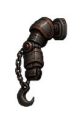
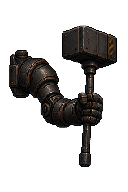
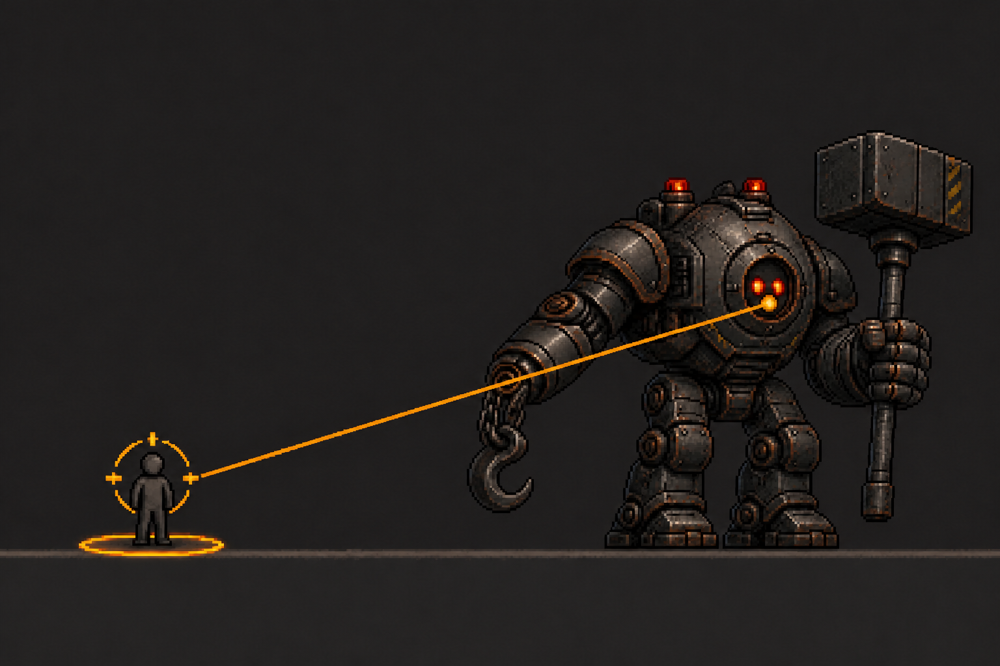
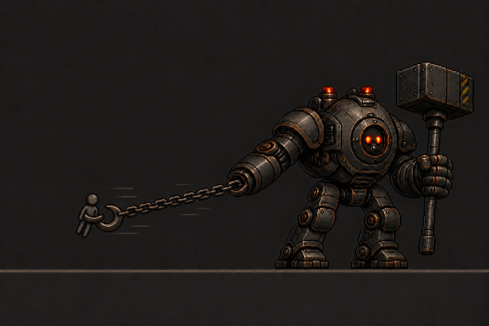

# BOSS03 LOWER SECTOR COMMANDER 이미지 생성 기획

> 상태: **CODE-AUDITED / REFERENCE-ONLY GRAPHICS / 주 시각 콘셉트·본체·사슬 훅·휴대형 해머·그랩 예고·끌어오기·구속 승인**
>
> 범위: 아래 이미지는 현재 Boss03 Polygon Runtime의 그래픽 검수 기준이다. PNG는 Arena geometry, Collision, Rope Anchor 또는 공격 판정의 근거가 아니며, 전투 규칙은 [Commander 참고 계약](./LOWER-SECTOR-COMMANDER-REFERENCE-CONTRACT.md)이 소유한다.

> 출처: 사용자 제공·승인 · `1672×941px` RGB PNG · SHA-256 `347A8FB97BE3FAB19BEFDA853DD6EC19EEBBCD47B97EDD0D6185B237E43854A7` · Runtime 사용권·투명 alpha·충돌 정보는 주장하지 않는다.

> 본체 기준: [그래픽 원본 README](../../../assets/artwork/characters/boss03-lower-sector-commander/README.md) · 사용자 선택 원본을 `128×192px` RGBA로 정규화한 검토 export · 한 프레임만 승인했으며 Runtime-ready를 뜻하지 않는다.

| # | 점검 요소 | AS-IS | TO-BE / 판정 |
| ---: | --- | --- | --- |
| 1 | 기준 위계 | 장면 콘셉트와 단독 본체 이미지의 역할이 같지 않다. | 장면 이미지는 세계관·크기 대비, 위 본체 이미지는 캐릭터 외형을 소유한다. 서로 Arena·Collision을 정하지 않는다. **통과** |
| 2 | 본체 실루엣 | 수평 드론형 또는 작은 인간형 메카로 흐를 수 있었다. | 둥근 장갑 본체·낮은 센서 헤드·넓은 어깨·짧고 굵은 두 다리·넓은 발의 중량형 2족 보행기로 승인했다. **통과** |
| 3 | 얼굴·팔레트 | 사람 얼굴·조종석·전면 네온으로 보일 수 있었다. | 검은 원형 판의 두 적·주황 센서와 먹색 강철·녹슨 철색·수리 패치만 유지한다. **통과** |
| 4 | 사슬 훅 | Rope나 별도 투사체로 오해할 수 있다. | 굵은 사슬과 곡선형 산업 훅은 중립 장착하며 기존 **그랩**만 표현한다. **통과** |
| 5 | 휴대형 해머 | 해머가 팔에 융합되거나 작게 보일 수 있었다. | 분절형 손이 별도 손잡이 하단을 쥐고, 손 위에 대형 사각 해머 머리를 둔다. 손·손잡이·머리 분리는 **통과**. |
| 6 | 방향·기준점 | 확대 시안만으로 실제 캔버스 기준을 알 수 없었다. | 우향, 두 발이 같은 바닥선에 닿는 발 중앙 anchor `(64, 152)`, 장비를 포함한 단일 실루엣으로 승인했다. **통과** |
| 7 | 픽셀 규칙 | 선택 원본은 `1024×1536` 확대 이미지다. | 8배 픽셀 블록을 `128×192` 정수 격자로 정규화했고 nearest-neighbor 형태를 유지했다. **통과** |
| 8 | 투명도 | 선택 원본의 체크무늬는 실제 RGB 배경이다. | 검토 export는 배경 alpha `0`, 본체 alpha `255`만 사용한다. 원본은 출처 보존용이며 export만 투명 검토에 사용한다. **통과** |
| 9 | 전투 규칙 | 승인 이미지가 새 공격이나 수치를 만들 수 있다. | 훅은 그랩, 해머는 확정 내려찍기 표현만 담당하며 피해 `20+40`·0.5초 해머 연계·15초 대기는 바꾸지 않는다. **통과** |
| 10 | Runtime 경계 | 크기·alpha 통과만으로 Runtime-ready로 오인할 수 있다. | 한 프레임 검토 export이며 Boss 전용 manifest·상태·validator가 없다. **REFERENCE-ONLY / Runtime 미착수**. |

> 사슬 훅 기준: 단일 체인·단일 대형 곡선 훅·중량형 분절 팔의 중립 파츠 · 현재 Polygon Runtime의 그랩 판정이나 범위를 바꾸지 않는다.

> 휴대형 해머 기준: 중량형 분절 팔·관절형 기계 손·별도 손잡이·대형 사각 머리의 중립 파츠 · 손은 손잡이 하단을 감싸 쥐고 머리는 손 위에 둔다. 현재 Polygon Runtime의 해머 판정이나 범위를 바꾸지 않는다.

> 그랩 예고 기준: 몸 중앙의 두 눈 사이 센서부에서 고정 대상에게 이어지는 황색 조준 레이저와 대상 발밑 경고 원을 동시에 표시한다. 훅 손목은 발광하지 않고 사슬 훅은 발사 전 상태를 유지한다. 이 넓은 프레임은 시각 가독성 참고이며 Arena·사거리·판정을 정하지 않는다.

> 끌어오기 기준: 훅 팔에서 이어지는 하나의 팽팽한 사슬과 하나의 대형 곡선 훅이 Player 허리를 붙잡아 보스 앞으로 당긴다. 눈 조준선·경고 원은 종료되고 해머는 중립 상태다. 이 넓은 프레임은 시각 가독성 참고이며 실제 이동·피해·충돌 판정을 정하지 않는다.

## 코드 기준 이미지 생성 범위

| # | AS-IS | TO-BE / 생성·판정 |
| ---: | --- | --- |
| 1 | Boss03은 `128×192` Polygon 본체로 제품에 반영되어 있고 전용 sprite binding이 없다. | 모든 생성물은 binding 전까지 **REFERENCE-ONLY**이며 collider·판정·Arena를 소유하지 않는다. |
| 2 | `neutral`은 승인 본체 한 프레임만 있다. | 동일 외형의 중립 호흡·회복 기준을 만든다. 기존 승인 본체가 외형 원본이다. |
| 3 | `walk`은 속도만 바뀌고 전용 시각 자료가 없다. | 우향 보행 기준 자세를 만든다. 체력 70%·35% 구간은 새 외형이 아니라 같은 보행의 속도 차이로 읽는다. **우선 생성** |
| 4 | `chain-hook-grab/telegraph`는 1.5초 대상 고정이며 코드 조준선은 본체 중심에서 시작한다. | 보스 자세와 훅 준비 자세를 만들고, 동적 조준선·발밑 원은 PNG에 굽지 않는다. 승인안의 **두 눈 사이 시작점**은 renderer 정렬 전까지 미연결 요구사항이다. |
| 5 | `chain-hook-grab/active` 안의 탐색·당김·구속·확정 해머 단계가 화면 객체에 전달되지 않는다. | 훅 발사, 팽팽한 당김, 보스 앞 구속, 확정 내려찍기를 서로 다른 참고 이미지로 만들되 `grabStage` 또는 capture phase가 노출되기 전에는 Runtime-ready라 부르지 않는다. |
| 6 | `hammer-slam`은 0.8초 예고와 0.2초 공격이 같은 든 자세에 가깝다. | 해머를 손으로 쥔 채 준비 자세와 지면 충돌 자세를 분리하고, 충격 VFX는 본체 PNG와 분리한다. |
| 7 | `body-charge`는 0.8초 예고 자세만 구분되고 0.6초 돌진 중 본체는 기본 자세로 돌아간다. | 웅크린 예고, 전진 중량 자세, 미끄럼·분진 VFX를 분리한다. |
| 8 | `boss-damaged` 사건은 있으나 Boss03 전용 피격 자세가 없다. | 전·후방 피격 반응 참고 이미지를 만들되 전용 controller binding 전까지 미연결로 표시한다. |
| 9 | `defeated`는 Polygon을 1.5초 회전시켜 끝낸다. | 센서 소등, 균형 붕괴, 지면 정지의 처치 상태를 만든다. |
| 10 | 현재 체인 길이·위험 범위·조준선·충격은 절차 그래픽이다. | 훅 머리·체인 반복 조각·손목 결합부·해머·충격·돌진 VFX를 역할별로 분리하며 고정 길이 체인, 사거리 원, 피해 숫자, HUD는 생성하지 않는다. |

## 이미지 생성·승인 순서

1. **중립** — 기존 승인 본체를 기준으로 완료했다.
2. **보행** — 우향 보행 접지 자세와 투명 `128×192` authoring export를 승인했다. Runtime 연결·Stage 1x 검수는 별도다.
3. **그랩 예고** — 넓은 대상 고정 관계 이미지와 본체만 분리한 투명 `128×192` 자세를 승인했다. 조준선·경고 원은 동적 표현으로 분리한다.
4. **당김** — 팽팽한 단일 사슬과 훅의 넓은 관계 이미지와 본체 `128×192`, 훅 머리 `48×48`, 체인 링크 `16×16` 분리 export를 승인했다. Runtime 연결·Stage 1x 검수는 별도다.
5. **구속** — Player가 보스 앞에 고정되고 해머가 중립인 넓은 관계 이미지와 본체 `128×192`, 재사용 훅 머리 `48×48`, 재사용 체인 링크 `16×16` 투명 export를 승인했다. Runtime 연결·Stage 1x 검수는 별도다.
6. **확정 해머** — 그랩 성공 뒤 회피 불가능한 내려찍기를 검수한다.
7. **독립 해머** — 별도 해머 공격의 준비·충돌 상태를 검수한다.
8. **돌진** — 웅크린 예고와 전진 중량 자세를 검수한다.
9. **피격** — 전·후방 피격 반응을 검수한다.
10. **처치** — 센서 소등·균형 붕괴·지면 정지 상태를 검수한다.

각 단위는 앞 단위의 외형 승인을 유지한다. 프레임 수와 Runtime 결합 방식은 이 문서에서 정하지 않는다.
