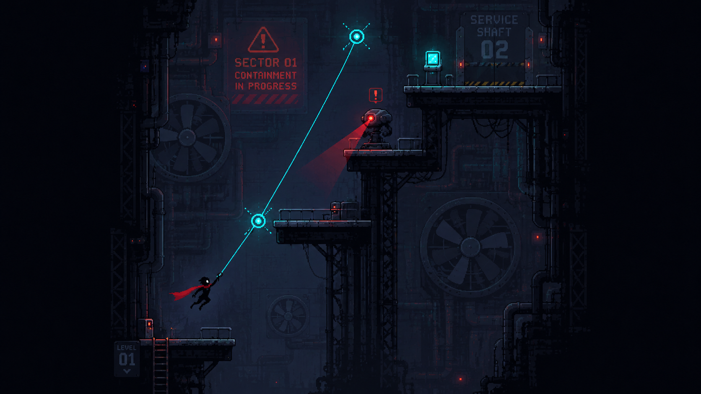
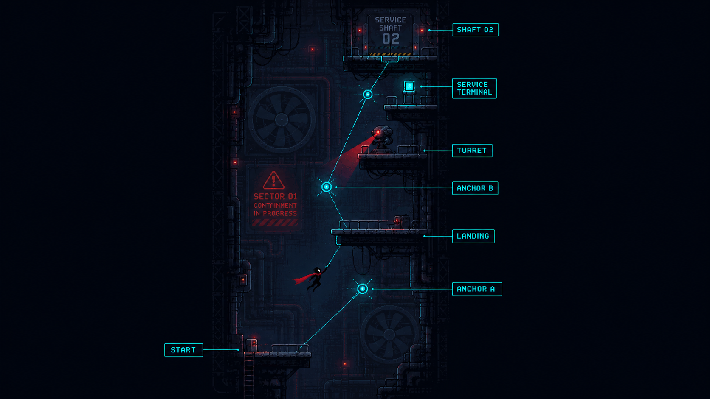

# SECTOR 01-1 — SERVICE SHAFT

*MAINTENANCE SECTOR / OPENING LEVEL — INTERNAL / LEVEL DESIGN DOC*

수직도시 최하부에서 시작하는 오프닝 튜토리얼 레벨. 플레이어에게 **Attach → Swing → Release → Landing**이라는 게임의 핵심 상승 루프를 시스템 설명 없이 체득시키는 것이 유일한 목표다.

`TARGET 1:30–2:00` · `FLOW BOTTOM → TOP` · `ANCHORS 2` · `ENEMIES 1 × SENTRY TURRET` · `EXIT SERVICE SHAFT 02`

## Contents

01. [이 구간의 목적](#01-이-구간의-목적)
02. [시작 상황 / 스토리](#02-시작-상황--스토리)
03. [공간 콘셉트](#03-공간-콘셉트)
04. [그래픽 방향](#04-그래픽-방향)
05. [플레이 화면의 깊이 (3 Layer)](#05-플레이-화면의-깊이-3-layer)
06. [실제 레벨 진행](#06-실제-레벨-진행)
07. [첫 번째 SENTRY TURRET](#07-첫-번째-sentry-turret)
08. [COOLING FAN](#08-cooling-fan)
09. [SERVICE TERMINAL & EXIT](#09-service-terminal--exit)
10. [1-1에 들어가는 오브젝트](#10-1-1에-들어가는-오브젝트)
11. [1-1에서 넣지 않는 시스템](#11-1-1에서-넣지-않는-시스템)
12. [카메라 규칙](#12-카메라-규칙)
13. [그래픽 담당 기준](#13-그래픽-담당-기준)
14. [레벨 리듬](#14-레벨-리듬--구현-시-이-순서-유지가-최우선)
15. [개발팀 전달용 핵심 요약](#15-개발팀-전달용-핵심-요약)

---

## 00 · VISUAL REFERENCE

| FIG.01 — GAMEPLAY VISUAL REFERENCE | FIG.02 — LEVEL LAYOUT |
|---|---|
|  |  |
| 실제 플레이 화면 기준 | START → ANCHOR A → LANDING → ANCHOR B → TURRET → TERMINAL → SHAFT 02 |

## 01 · 이 구간의 목적

1-1 SERVICE SHAFT는 게임의 첫 번째 실제 플레이 구간이다. 이 레벨의 목표는 플레이어에게 많은 시스템을 설명하는 것이 아니다.

> **CORE LOOP**
> 이동 → **Anchor 발견** → **Rope Attach** → **Swing** → **Release** → 더 높은 위치에 착지
>
> 이 상승 루프를 설명 없이 자연스럽게 익히게 하는 것이 전부다.

예상 첫 플레이 시간은 **약 1분 30초 ~ 2분**.

이 게임은 기본적으로 수직도시의 아래에서 위로 올라가는 구조이기 때문에, 1-1부터 맵의 진행 방향이 명확하게 **아래 → 위**로 읽혀야 한다. 중간에 좌우 Swing은 존재하지만, **모든 좌우 이동의 목적은 결국 높이를 얻는 것**이다.

## 02 · 시작 상황 / 스토리

주인공은 수직도시의 하층 설비를 관리하는 **수직 인프라 정비기사**다. 사고 발생 직전 Sector 01의 Vertical Grid 이상 신호를 확인하기 위해 Service Shaft 내부에서 작업하고 있었다.

작업 도중 도시 인프라에 대규모 장애가 발생하고 **CONTAINMENT PROTOCOL**이 실행된다. 비상전력이 들어오면서 플레이어 뒤쪽 전광판에 문구가 나타난다.

> **▲ SIGNAGE**
> `SECTOR 01`
> `CONTAINMENT IN PROGRESS`

자동 방송에서는 `Remain in your assigned sector.` 라는 안내가 반복된다. 하지만 하층은 순차적으로 폐쇄되고 있기 때문에 플레이어는 살아남기 위해 위쪽 Maintenance 구역으로 이동해야 한다.

> **PLAYER MUST KNOW — 딱 3가지**
> 1. 사고가 발생했다.
> 2. 현재 구역이 폐쇄되고 있다.
> 3. 위로 올라가야 한다.
>
> 1-1에서는 기업의 진실이나 계층 문제를 아직 설명하지 않는다.

## 03 · 공간 콘셉트

Service Shaft는 **지하 동굴이 아니다.** 지상에 세워진 거대한 수직 기업도시 최하부의 **산업설비 공간**이다. 공간 내부에는 도시 전체를 유지하는 거대한 설비가 존재한다.

| STRUCTURE | UTILITY | TRAVERSAL |
|---|---|---|
| 대형 냉각팬 | 전력 케이블 | 작업자용 캣워크 |
| 굵은 배관 | 유지보수 장치 | 사다리 |
| 설비 프레임 | 비상 경고등 | |
| 수직 샤프트 | | |

> **DESIGN INTENT**
> 플레이어보다 훨씬 큰 산업설비를 배경에 두어 **"이 도시가 엄청난 규모의 기계 위에서 돌아가고 있다"**는 느낌을 준다.

## 04 · 그래픽 방향

레퍼런스 이미지(FIG.01)의 그래픽 방향을 기준으로 한다. 전체 스타일은:

> **MINIMAL SILHOUETTE PIXEL ACTION + CYBERPUNK INDUSTRIAL**

실사풍이나 지나치게 세밀한 픽셀아트보다는, **실제 게임 화면에서 읽히는 간결한 실루엣 중심의 저해상도 픽셀 그래픽**이 최종 목표다.

### 색의 역할

| ELEMENT | COLOR | NOTE |
|---|---|---|
| 환경 | Dark Navy / Charcoal / Black / 저채도 청회색 | 배경은 정보가 아니다. 최대한 가라앉힌다. |
| Player | 어두운 몸체 + 긴 Red Scarf | **스카프가 가장 중요한 식별 요소** |
| Rope / Anchor | Cyan | Cyan은 Anchor/Rope 전용으로 최대한 아낀다. |
| Enemy / 위험 | Red / Orange | 위험 = Red. 예외를 만들지 않는다. |
| 비상조명 | 제한적인 Red | 남용하면 Turret 경고선이 죽는다. |

> **▲ RULE**
> 화면 전체를 Cyberpunk 네온으로 채우지 않는다. 배경이 화려해지는 순간 Anchor와 플레이어가 안 보인다. **색깔은 장식이 아니라 Gameplay Information이다.**

## 05 · 플레이 화면의 깊이 (3 Layer)

**① FOREGROUND — GAMEPLAY**
플랫폼 / 캣워크 / 벽, Anchor, Turret, Player — 가장 선명. 충돌이 실제로 일어나는 레이어.

**② MIDGROUND — ACTIVE MACHINERY**
작은 팬 / 파이프, 케이블 / 경고등, 피스톤 — 미세하게 움직여 공간이 살아 있다는 느낌을 준다.

**③ BACKGROUND — CITY MACHINERY**
거대한 Cooling Fan, Vertical Shaft, 대형 구조 프레임 / 아득한 설비층 — 저대비·저채도. Gameplay Layer와 경쟁 금지.

## 06 · 실제 레벨 진행

### STEP 01 — START PLATFORM

플레이어는 화면 가장 아래쪽 **안전한 작업 플랫폼**에서 시작한다. 처음 5~10초는 적이 없다. 여기서 플레이어가 자연스럽게 **이동 / 점프 / 캐릭터 관성**을 확인할 수 있게 한다.

시작 직후부터 그래플을 강요하지 않는다. 뒤쪽에는 SECTOR 01 CONTAINMENT 경고판과 대형 설비가 보인다.

### STEP 02 — ANCHOR A / 첫 번째 GRAPPLE

첫 플랫폼의 끝에는 **점프로는 쉽게 도달할 수 없는 높이 차**를 만든다. 플레이어보다 대각선 위쪽에 Anchor A를 배치하고, 다른 배경요소보다 확실히 밝은 Cyan으로 표현한다.

- 여기서는 **Attach → Swing → Release → 상단 플랫폼 착지**만 학습한다.
- 터렛이나 다른 장애물은 없다.
- 첫 그래플은 **거의 반드시 성공할 수 있는 구조**로 만든다.
- 떨어져도 즉사하지 않고 아래 안전구간으로 복귀할 수 있어야 한다.

> **DESIGN GOAL**
> 플레이어가 처음으로 **"Rope를 걸고 흔들어서 올라가는 게임이구나"** 라고 이해하게 만드는 구간.

### STEP 03 — LANDING / 짧은 휴식

첫 Swing을 성공하면 중간 플랫폼에 착지한다. 여기서는 잠깐 안전하다.

- 플레이어가 **이전 위치보다 확실히 높아졌다는 것을 화면으로 느껴야** 한다.
- 위쪽에 두 번째 Anchor가 보여야 한다.
- 카메라는 다음 이동 경로를 미리 보여준다.

### STEP 04 — ANCHOR B / 두 번째 GRAPPLE

Anchor B는 A보다 조금 더 어려운 위치에 둔다. 첫 번째가 *Rope 사용법*을 배우는 단계였다면, 두 번째는 **Swing으로 고도를 얻는 방법**을 배우는 구간이다.

Anchor B의 위치 때문에 단순히 매달리는 것만으로는 부족하고, 적절히 흔들어서 Release해야 다음 플랫폼에 올라갈 수 있게 한다. 다만 **매우 정밀한 조작은 요구하지 않는다.**

> **DESIGN GOAL**
> Rope는 단순 이동선이 아니라 **운동량을 이용해 높이를 얻는 도구**다.

## 07 · 첫 번째 SENTRY TURRET

두 번의 Rope 성공 이후 처음 적을 보여준다. 터렛은 상단 측면 플랫폼에 위치한다. 처음 플레이어를 발견하면 **즉시 발사하지 않는다.**

`SENSOR ON` → `RED AIM LINE` → `짧은 조준 시간` → `PROJECTILE 발사`

플레이어는 총알을 맞고 나서 위험을 이해하는 것이 아니라, **Red Line을 보는 순간 위험을 예측**할 수 있어야 한다.

> **▲ 첫 터렛의 목적**
> 플레이어를 죽이는 것이 아니다. **"멈춰 있으면 위험하다 → Rope를 이용해 계속 움직여야 한다"**를 가르치는 것이다.

### 터렛에 대한 정답은 하나가 아니다

1-1부터 플레이어에게 정확한 풀이를 강요하지 않는다. 플레이어는:

- 터렛 아래를 빠르게 지나갈 수도 있고,
- 높은 Anchor를 이용해 사선을 넘어갈 수도 있고,
- 현재 게임의 공격 시스템을 이용해 제거할 수도 있다.

> **CORE PRINCIPLE — 이후 모든 적에 동일 적용**
> 적은 **HP를 깎기 위한 장치가 아니라 Rope 경로를 바꾸는 장치**다.

## 08 · COOLING FAN

레퍼런스에 보이는 거대한 Fan은 1-1에서는 **Background Landmark**다. 접촉 피해나 강한 Wind Physics를 아직 사용하지 않는다.

**1-1 연출 범위**: 천천히 회전 · 낮은 기계음 · 약한 먼지 / 공기 흐름

**FUTURE — SECTOR 1 후반부**: 실제 Fan Hazard로 재등장시켜 **"아까 배경에 있던 기계가 이제 위험요소가 됐다"**는 방식으로 확장한다.

## 09 · SERVICE TERMINAL & EXIT

### Service Terminal

1-1의 Cyan Terminal은 **Maintenance Node가 아니다.** 여기서는 증강 선택을 하지 않는다. 명칭은 `SERVICE TERMINAL`.

역할은 단순하다. 플레이어가 접근하여 Interact → 화면에 `SERVICE GATE OVERRIDE` 표시 → 잠시 후 상단의 Gate가 열린다.

> **WORLD RULE**
> 이 Terminal의 또 다른 목적은 **"정비사인 나는 이런 도시 설비를 조작할 수 있다"**는 세계관 규칙을 가르치는 것이다. 나중에 등장하는 Maintenance Node / Augment System의 **시각적 전조** 역할도 한다.

### EXIT — SERVICE SHAFT 02

Terminal을 작동시키면 최상단 Gate가 열린다. 표시는 `SERVICE SHAFT 02`. 플레이어가 Gate에 진입하면 1-1 종료.

> **▲ NO CUTSCENE**
> 별도의 컷신 없이 바로 다음 구간으로 연결한다. **1-1부터 게임의 흐름을 끊지 않는다.**

## 10 · 1-1에 들어가는 오브젝트

| OBJECT | ROLE |
|---|---|
| Player | 이동 / 점프 / 그래플 |
| Anchor A | 첫 Rope 학습 |
| Anchor B | Swing 상승 학습 |
| Landing Platform | 이동 리듬과 안전지대 |
| Sentry Turret ×1 | 첫 이동 압박 |
| Service Terminal | 상호작용 학습 |
| Service Gate | 다음 구간 연결 |
| Cooling Fan | 배경 / 미래 Hazard 예고 |
| Containment Sign | 스토리 전달 |

## 11 · 1-1에서 넣지 않는 시스템

이것도 중요하다. **첫 Level의 시스템 수를 의도적으로 제한한다.**

Augment 선택 · Maintenance Node · Drone · Guard Robot · Rope Cutter · Laser Grid · 강한 Fan Wind · Moving Platform · 복수 Turret · 복잡한 전투 · 긴 텍스트 로그 · 강제 스토리 컷신

## 12 · 카메라 규칙

카메라는 캐릭터를 크게 보여주는 것보다 **다음 Rope 판단을 가능하게 하는 것**이 중요하다.

| 구간 | 한 화면에 반드시 보여야 하는 것 |
|---|---|
| 첫 GRAPPLE | Player + Anchor A + Landing Platform |
| 두 번째 GRAPPLE | 현재 Platform + Anchor B + 다음 Landing |
| TURRET 구간 | Player + Rope Candidate + Turret |

> **GLOBAL**
> 카메라는 플레이어가 올라갈수록 같이 위로 이동하며, **항상 아래보다 위쪽 공간을 조금 더 보여준다.**

## 13 · 그래픽 담당 기준

FIG.01을 **Gameplay Visual Reference**로 사용한다. 유지해야 할 요소:

**ENVIRONMENT**: 어두운 산업 샤프트 · 거대한 배경 Fan · 높은 세로 비율의 공간

**PLAYER**: 작고 명확한 Silhouette · 긴 빨간 스카프

**SIGNAL**: Cyan Rope / Cyan Anchor · Red Turret Sensor · Red Containment Sign

> **▲ 구현 시 주의**
> 생성 이미지의 픽셀 디테일 자체를 복사할 필요는 없다. 실제 제작에서는 현재 프로젝트 그래픽 규격과 **Sprite Contract**에 맞게 단순화한다.
>
> Rope와 긴 Scarf 움직임은 **Sprite Sheet에 통째로 구워 넣지 않고 런타임 연출을 우선**한다.

## 14 · 레벨 리듬 — 구현 시 이 순서 유지가 최우선

START → 기본 이동 → **ANCHOR A 발견** → **첫 ATTACH** → **SWING** → **RELEASE** → 첫 착지 → **ANCHOR B** → 더 높은 위치로 상승 → SENTRY TURRET 발견 → 터렛 사선을 ROPE 이동으로 통과 → SERVICE TERMINAL → GATE OVERRIDE → **SERVICE SHAFT 02**

## 15 · 개발팀 전달용 핵심 요약

Sector 1-1 SERVICE SHAFT는 수직도시 최하부에서 시작하는 **약 1분 30초~2분 길이의 오프닝 튜토리얼**이다.

플레이어는 안전한 하단 작업 플랫폼에서 시작해 **두 개의 Anchor**를 차례로 사용하면서 **Attach → Swing → Release → Landing**이라는 게임의 핵심 상승 루프를 익힌다.

두 번째 그래플 이후 **첫 Sentry Turret**이 등장하며, 터렛은 플레이어를 죽이는 역할보다 **멈추지 않고 Rope 경로를 선택하도록 압박하는 역할**을 한다.

마지막에는 정비사용 **Service Terminal**을 조작해 상단 Gate를 개방하고 **SERVICE SHAFT 02**로 이동한다.

전체 진행은 반드시 **아래에서 위로** 읽혀야 하며, 그래픽은 어두운 산업설비 · 작은 검은 플레이어 실루엣 · 긴 빨간 스카프 · Cyan Rope/Anchor · Red 위험요소를 중심으로 구성한다.

---

## 폴더 구조

```
.
├── README.md                         # 이 문서 (Markdown, GitHub에서 바로 렌더링)
└── images/                           # 원본 레퍼런스 (고해상도 PNG)
    ├── 01_gameplay_reference.png     # Gameplay Visual Reference
    └── 02_level_layout.png           # Annotated Level Layout
```

SECTOR 01-1 / SERVICE SHAFT — LEVEL DESIGN DOC · REV 1.0
