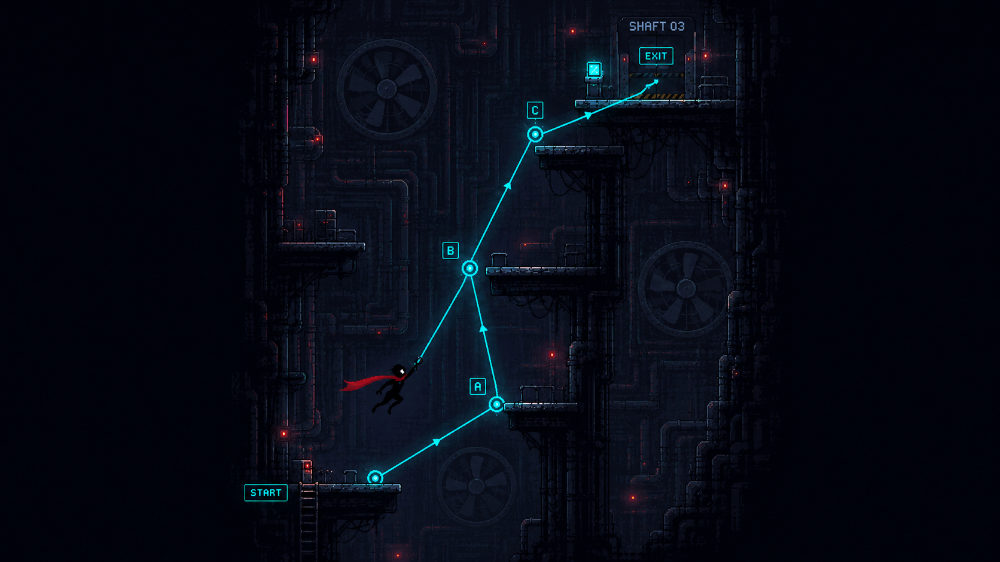
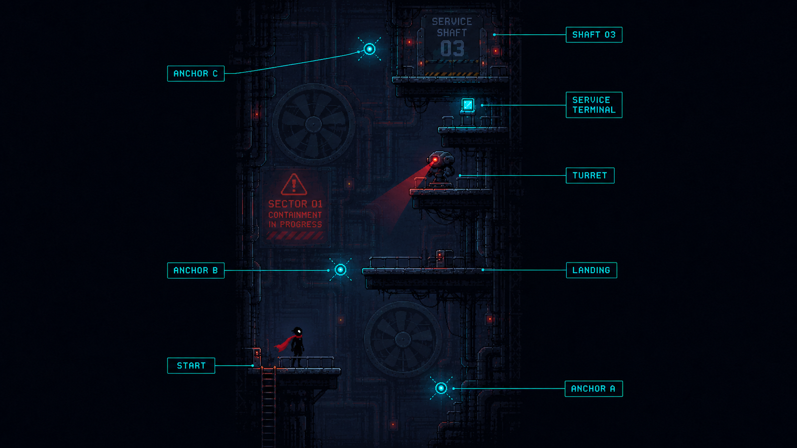

# SECTOR 01-2 — DOUBLE ANCHOR SHAFT

*FIRST CHAIN GRAPPLE / VERTICAL UTILITY SHAFT — INTERNAL / LEVEL DESIGN DOC*

◀ PREV — [SECTOR 01-1 / SERVICE SHAFT](../1-1/README.md)

1-1에서 익힌 **단일 Grapple**을 **연속 Grapple**로 확장하는 레벨. 이 구간의 핵심 질문은 딱 하나다 — *"첫 번째 Rope를 놓은 다음, 바로 다음 Anchor를 잡을 수 있는가?"*

`TARGET 1:00–2:00` · `FLOW BOTTOM → TOP` · `ANCHORS 3 (A / B / C)` · `ENEMIES 1 × TURRET (재사용)` · `NEW AIR RE-ATTACH` · `EXIT SERVICE SHAFT 03`

> 스타일이 적용된 단일 파일 버전은 [`index.html`](index.html)에도 있습니다. 이 README는 GitHub에서 바로 렌더링되는 동일 내용의 Markdown 버전입니다.

## Contents

00. [Visual Reference](#00--visual-reference)
01. [역할 — 첫 연속 그래플 구간](#01--역할--첫-연속-그래플-구간)
02. [스토리 상황](#02--스토리-상황)
03. [공간 형태](#03--공간-형태)
04. [STEP 01 — 첫 번째 ANCHOR](#04--step-01--첫-번째-anchor)
05. [STEP 02 — 첫 연속 GRAPPLE](#05--step-02--첫-연속-grapple--1-2의-핵심)
06. [실패해도 진행이 끊기지 않아야 함](#06--실패해도-진행이-끊기지-않아야-함)
07. [카메라가 여기서 처음 중요해짐](#07--카메라가-여기서-처음-중요해짐)
08. [ANCHOR C — 방향 전환](#08--anchor-c--방향-전환)
09. [TURRET은 어떻게 넣을까](#09--turret은-어떻게-넣을까)
10. [새로운 적은 아직 없음](#10--새로운-적은-아직-없음)
11. [환경 랜드마크](#11--환경-랜드마크)
12. [그래픽](#12--그래픽)
13. [이번 레벨의 이상적인 플레이](#13--이번-레벨의-이상적인-플레이)
14. [1-2의 성공 기준](#14--1-2의-성공-기준)
15. [개발자 전달용 핵심 요약](#15--개발자-전달용-핵심-요약)

---

## 00 · VISUAL REFERENCE

| FIG.01 — SWING LINE | FIG.02 — LEVEL LAYOUT |
|---|---|
|  |  |
| START → A → B → C → EXIT. 좌우 교차 Anchor로 한 호흡에 이어지는 이상적 라인 | ANCHOR A·B·C, LANDING, TURRET, SERVICE TERMINAL, SHAFT 03 |

## 01 · 역할 — 첫 연속 그래플 구간

핵심 질문은 하나야. **"첫 번째 Rope를 놓은 다음, 바로 다음 Anchor를 잡을 수 있는가?"**

1-1에서는 `Attach → Swing → Release → 착지`가 기본이었다면, 1-2부터는:

> Attach → Swing → Release → 공중에서 다음 Anchor 탐색 → Attach → 다시 Swing

으로 확장한다.

아직 증강은 없다. 플레이어가 기본 Rope 자체를 먼저 재미있게 사용할 수 있어야 한다.

## 02 · 스토리 상황

1-1의 Service Gate를 통과하면 플레이어는 같은 Maintenance Sector의 더 깊은 Vertical Utility Shaft로 들어온다.

그런데 정상 정비용 승강기가 정지돼 있다. 배경 표시: `LIFT CONTROL OFFLINE`

조금 위에는 비상등 아래: `MANUAL ACCESS ONLY` 가 보인다.

즉 여기부터는 단순히 문을 열고 이동하는 것이 아니라 정비용 구조물을 직접 타고 올라가야 한다.

이때 아래쪽에서 짧게: `SECTOR 01 POWER REDUCTION — STAGE 2` 가 뜬다.

> **WORLD RULE**
> 1-1의 `CONTAINMENT IN PROGRESS`가 이제 실제로 진행되고 있다는 걸 처음 보여주는 거야.

## 03 · 공간 형태

1-1보다 더 좁고 더 높은 수직 샤프트로 만든다. 구조는 좌우 플랫폼이 번갈아 배치되는 형태가 좋아.

```
               EXIT
                │
       ┌────────┘
       │       ● C
       │
  ● B  │
       │
       │        PLATFORM
       │
       │
       │  ● A
       │
 START └────────
```

핵심은 단순히 Anchor가 위에 일렬로 있는 게 아니라, **오른쪽 → 왼쪽 → 오른쪽** 식으로 플레이어가 Swing 방향을 계속 바꿔야 한다는 것. 그래야 Rope가 단순한 엘리베이터처럼 느껴지지 않아.

## 04 · STEP 01 — 첫 번째 ANCHOR

1-1에서 이미 그래플을 배웠기 때문에 이번에는 첫 Anchor를 바로 보여준다.

시작 플랫폼 위 대각선 방향. 붙어서 Swing하면 상단 플랫폼으로 갈 수 있다. 여기까지는 복습.

하지만 착지 플랫폼을 길게 만들지 않는다. 착지하자마자 화면 위쪽에서 두 번째 Anchor B가 보여야 한다.

> **DESIGN GOAL**
> 플레이어가 "또 위로 가야 하는구나."를 즉시 이해하게 한다.

## 05 · STEP 02 — 첫 연속 GRAPPLE ← 1-2의 핵심

여기가 1-2의 핵심.

플레이어가 Anchor A에서 Swing한 뒤 충분한 높이를 얻으면: `Release → 공중 상태`가 된다.

그리고 같은 화면의 반대쪽 위에 Anchor B가 있다. 이 순간 다음 Attach를 성공하면:

```
Anchor B ●
          \
           \
            P  ← 공중에서 재연결
           /
          /
Anchor A ●
```

처음으로 땅을 밟지 않고 두 Anchor를 연속해서 사용하는 경험이 나온다.

첫 성공에서는 굉장히 기분 좋은 연출을 주는 게 좋아. 작은 `WHOOSH`, Rope 재연결 Flash, Scarf가 반대 방향으로 확 펴짐 정도. 화려한 VFX는 필요 없다.

## 06 · 실패해도 진행이 끊기지 않아야 함

여기 중요해. Anchor B를 놓쳤다고 추락사시키면 아직 너무 이르다. 아래에 Recovery Platform을 둔다.

실패하면:

```
      ● B

       X ← 실패

       ↓

 ─────────────
 RECOVERY
```

여기로 떨어진다. 여기서 다시 Anchor B를 잡을 수 있다.

즉 숙련자는 `A → B` 공중 연계, 초보자는 `A → 착지 → B`로도 통과 가능.

> **DESIGN PRINCIPLE**
> 이렇게 해야 Skill Ceiling은 열어두면서 튜토리얼은 막히지 않는다.

## 07 · 카메라가 여기서 처음 중요해짐

1-2에서 카메라 규칙을 하나 더 추가한다. Swing 중 플레이어가 위쪽으로 움직이면 카메라도 약간 먼저 위를 보여준다.

왜냐하면 플레이어가 Release했을 때 다음 Anchor가 화면 밖에 있으면 연속 그래플을 할 수 없기 때문이야.

그래서 **현재 캐릭터 중심 추적**보다 **캐릭터의 진행 방향, 특히 위쪽 공간을 미리 보여주는 카메라**가 중요해진다. 1-2에서 이걸 테스트해야 해.

## 08 · ANCHOR C — 방향 전환

A → B까지 성공했다면 마지막은 조금 다르게 한다. Anchor C는 B에서 거의 정반대 방향에 배치한다. 즉:

```
             ● C

      P →
        \
         ● B
```

B에서 한쪽으로 Swing하다가 Release해서 반대편 Anchor C를 잡는다.

> **DESIGN GOAL**
> 여기서 플레이어는 처음 **Rope는 위로만 당기는 장치가 아니라 방향을 바꾸는 장치**라는 걸 경험한다. 이게 이후 레벨 디자인에 굉장히 중요해.

## 09 · TURRET은 어떻게 넣을까

1-2에는 터렛 하나를 넣어도 되지만 전투용으로 사용하지 않는다. 예를 들어 Anchor B 부근의 측면 플랫폼에 하나 배치한다.

그런데 위치를 이렇게 잡는다. 가만히 Recovery Platform에 오래 서 있으면 터렛 사선에 들어온다. 반대로 `A → B` 연속 그래플을 성공하면 거의 공격받지 않는다.

> **CORE PRINCIPLE**
> 터렛이 말하는 것은 "연속해서 움직이면 더 안전하다." 야. 좋은 플레이를 공격력으로 보상하는 게 아니라 위험을 줄이는 방식으로 먼저 보상한다.

## 10 · 새로운 적은 아직 없음

1-2에서도 Drone, Runner, Cutter 같은 새 적은 넣지 않는다. 1-1에서 본 Turret을 조금 더 복잡한 공간에 재사용하는 게 맞다.

플레이어가 시스템 하나를 충분히 이해하기 전에 새 적을 계속 넣으면 학습이 흐려져.

## 11 · 환경 랜드마크

1-1의 대표적인 배경이 대형 Cooling Fan이었다면, 1-2는 수직 전력 케이블과 정지된 Maintenance Lift가 랜드마크가 되면 좋다.

샤프트 중앙에 거대한 승강기 레일이 있지만 Cabin은 멈춰 있다. 플레이어는 그 주변을 Rope로 올라간다.

> **WORLD RULE**
> "정상적으로라면 엘리베이터로 몇 초 만에 올라갈 공간을, 지금은 그래플로 직접 올라가고 있다." — 스토리와 Gameplay가 연결돼.

## 12 · 그래픽

1-1과 같은 Maintenance Art Direction을 유지하면서 차이를 준다.

| SECTOR | 특징 |
|---|---|
| 1-1 | 큰 Fan / 넓은 산업공간 / 첫 그래플 |
| 1-2 | 좁고 높은 Shaft / Elevator Rail / Vertical Cable / 좌우 교차 플랫폼 |

배경은 여전히 Dark Navy / Charcoal. 플레이 정보는 Anchor/Rope = Cyan, Turret = Red, Player Scarf = Red 색을 유지한다.

> **DESIGN INTENT**
> 그러면 같은 Sector라는 통일성은 있으면서도 방의 실루엣이 완전히 달라져.

## 13 · 이번 레벨의 이상적인 플레이

숙련자가 플레이하면:

> START → A Attach → Swing → Release → 공중 B Attach → 방향 전환 Swing → Release → C Attach → 상단 Landing → Exit.

거의 땅을 밟지 않고 한 호흡에 올라갈 수 있어야 한다.

초보자는:

> Start → A → Landing → B → Recovery → C → Exit

처럼 천천히 올라가도 된다.

> **DESIGN PRINCIPLE**
> 같은 Level이 초보자에게는 플랫폼 게임이고, 숙련자에게는 하나의 연속 Swing Line처럼 느껴져야 한다.

## 14 · 1-2의 성공 기준

이 레벨을 플레이한 사람이 끝났을 때, "Rope를 다시 걸 수 있다."가 아니라 **"Rope를 놓는 순간이 다음 Rope의 시작이구나."**를 이해했다면 성공이다.

이게 이후 RELAY 같은 증강의 기반이 된다. 증강을 먹기 전부터 연속 그래플이 재미있어야 하고, 나중에 RELAY를 먹으면 이 행동이 더 강력하고 더 관대해지는 것이지, 없던 행동이 갑자기 생기면 안 돼.

## 15 · 개발자 전달용 핵심 요약

Sector 1-2 `DOUBLE ANCHOR SHAFT`는 1-1에서 익힌 단일 Grapple을 연속 Grapple로 확장하는 약 1~2분짜리 수직 레벨이다. 좌우에 교차 배치된 Anchor A/B/C를 이용해 플레이어가 Release 직후 공중에서 다음 Anchor를 잡는 경험을 제공한다. 숙련자는 바닥을 거의 밟지 않고 한 호흡에 상승할 수 있고, 초보자는 중간 Recovery Platform을 이용해 단계적으로 통과할 수 있어야 한다. Turret은 플레이어를 죽이는 목적이 아니라 오래 멈춰 있는 것을 불리하게 만들어 연속 이동을 유도한다. 공간의 대표 랜드마크는 정지된 Maintenance Lift와 거대한 수직 케이블이며, 전체 그래픽은 1-1의 어두운 산업 픽셀 스타일과 Cyan Rope/Anchor, Red 위험 신호, Red Scarf 규칙을 그대로 유지한다.

---

## 폴더 구조

```
.
├── index.html                        # 레벨 디자인 문서 (스타일 적용 단일 파일)
├── README.md                         # 이 문서 (Markdown 버전, GitHub에서 바로 렌더링)
└── images/                           # 원본 레퍼런스 (고해상도 PNG)
    ├── 01_swing_line.png             # Swing Line Reference
    └── 02_level_layout.png           # Annotated Level Layout
```

SECTOR 01-2 / DOUBLE ANCHOR SHAFT — LEVEL DESIGN DOC
