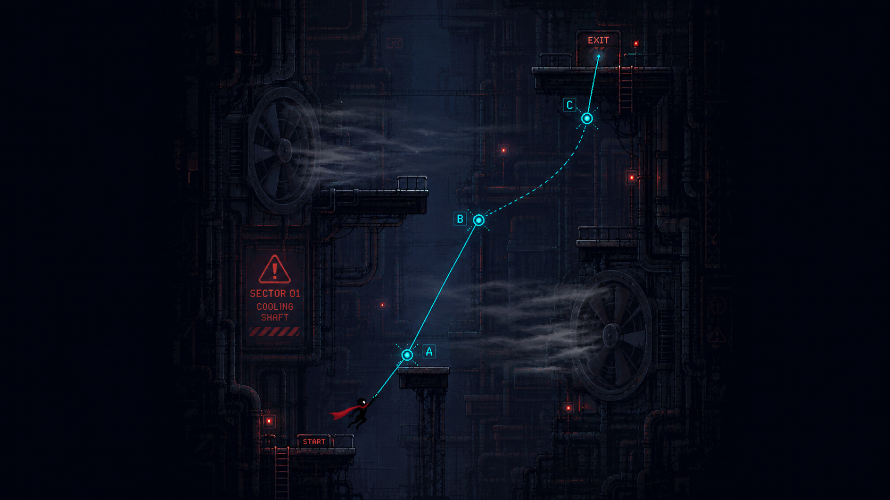
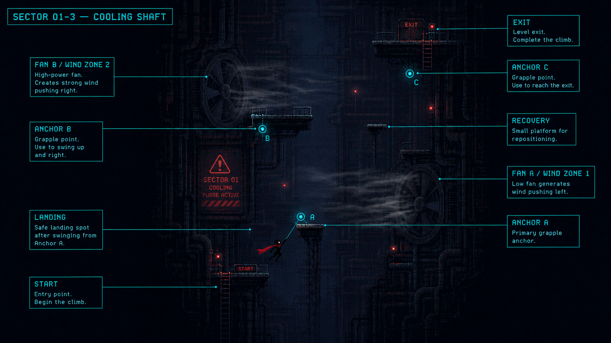

# SECTOR 01-3 — COOLING SHAFT

*Maintenance Sector / Level 3*

◀ PREV — [SECTOR 01-2 / DOUBLE ANCHOR SHAFT](../1-2/README.md)

1-1에서 Rope를 배웠고, 1-2에서 Rope를 연속으로 연결했다면, 1-3에서는 외부 힘 때문에 Swing 궤적이 변할 때 이를 읽고 이용하는 법을 배운다.

`핵심 학습 CROSSWIND + SWING TIMING` · `TARGET 1:30–2:00` · `NEW 냉각팬의 횡풍` · `ENEMIES 없음` · `AUGMENTS 없음`

## Contents

00. [Visual Reference](#00--visual-reference)
01. [스토리 상황](#01--스토리-상황)
02. [공간 콘셉트](#02--공간-콘셉트)
03. [팬의 게임 규칙](#03--팬의-게임-규칙)
04. [바람은 반드시 보기 전에 알 수 있어야 한다](#04--바람은-반드시-보기-전에-알-수-있어야-한다)
05. [STEP 01 — 안전하게 팬을 보여준다](#05--step-01--안전하게-팬을-보여준다)
06. [STEP 02 — FAN A / 약한 바람](#06--step-02--fan-a--약한-바람)
07. [STEP 03 — 바람을 이용하는 구간](#07--step-03--바람을-이용하는-구간)
08. [STEP 04 — FAN B / 첫 타이밍 판단](#08--step-04--fan-b--첫-타이밍-판단)
09. [Anchor B → C가 레벨의 핵심](#09--anchor-b--c가-레벨의-핵심)
10. [실패 경로](#10--실패-경로)
11. [적은 아예 넣지 않는다](#11--적은-아예-넣지-않는다)
12. [팬 날개도 아직 즉사 요소가 아니다](#12--팬-날개도-아직-즉사-요소가-아니다)
13. [그래픽 방향](#13--그래픽-방향)
14. [사운드도 게임플레이 정보로 활용](#14--사운드도-게임플레이-정보로-활용)
15. [카메라](#15--카메라)
16. [전체 플레이 흐름](#16--전체-플레이-흐름)
17. [1-3에서 절대 추가하지 않을 것](#17--1-3에서-절대-추가하지-않을-것)
18. [개발팀 전달용 요약](#18--개발팀-전달용-요약)

---

## 00 · VISUAL REFERENCE

| FIG.01 — SWING LINE | FIG.02 — ANNOTATED LAYOUT |
|---|---|
|  |  |
| START → A → B → C → EXIT. 팬 A/B의 횡풍을 타고 이어지는 이상적 라인 | START, ANCHOR A/B/C, FAN A/B (WIND ZONE), LANDING, RECOVERY, EXIT |

## 01 · 스토리 상황

1-2의 상단 Service Gate를 통과하면 도시의 Cooling Distribution Shaft로 진입한다.

Sector 01의 전력이 단계적으로 차단되면서 정상 냉각 시스템도 불안정해졌고, 중앙 시스템은 남은 열을 강제로 배출하기 위해 일부 대형 환기팬을 비상 운전한다.

배경 시스템 표시: `COOLING PURGE ACTIVE` · `MANUAL ACCESS HAZARD`

그리고 잠깐 후: `SECTOR 01 POWER REDUCTION — STAGE 3`

> **WORLD RULE**
> 1-2에서는 단순히 Lift가 죽었다면, 이제 도시 설비 자체가 불안정한 환경으로 변하기 시작하는 거야. 하지만 아직 도시가 플레이어를 적극적으로 죽이려고 하는 단계는 아니다. 팬도 보안장치가 아니라 고장 난 도시가 만들어내는 환경 위험이다.

## 02 · 공간 콘셉트

1-2가 좁은 승강기 Shaft였다면 1-3은 조금 더 넓은 수직 Cooling Chamber다. 양쪽 벽에 플레이어보다 훨씬 큰 환기팬이 박혀 있다.

형태는 대략:

```
                   EXIT
                    ↑
             ● C
        FAN B  >>>>>>>>>
       ───────────
            Landing
                   ● B
 <<<<<<<<<< FAN A
       ───────────
             ● A
          START
```

> **DESIGN INTENT**
> 핵심은 플랫폼 숫자를 늘리는 게 아니라 넓은 빈 공간 자체를 플레이 구간으로 사용하는 것이다. 그래야 Rope와 바람이 화면의 주인공이 된다.

## 03 · 팬의 게임 규칙

팬은 단순히 닿으면 죽는 장애물이 아니다. 1-3에서는 오직 **횡풍을 만드는 장치**로 사용한다.

팬이 작동하는 동안 특정 직사각형 공간에 일정 방향의 힘이 발생한다. 예를 들어:

> `FAN → → → → PLAYER`

이면 공중에 있는 플레이어의 궤적이 오른쪽으로 밀린다. Rope가 연결돼 있다면 Rope 길이나 Anchor 자체가 바뀌는 게 아니라 플레이어 몸에 외력이 들어가 Swing Arc가 변한다.

> **CORE PRINCIPLE**
> Rope 규칙은 그대로인데 환경 조건만 달라진다. 이게 중요해.

## 04 · 바람은 반드시 보기 전에 알 수 있어야 한다

갑자기 캐릭터를 밀면 불쾌하다. 플레이어가 팬 상태를 시각적으로 예측할 수 있어야 한다.

팬 작동 전에는 붉거나 주황색 Warning Lamp가 깜빡인다. 활성화되면 먼지 · 작은 증기 · 천 조각 파티클이 한 방향으로 이동한다.

그리고 주인공의 긴 빨간 스카프가 바람 방향으로 먼저 반응한다.

> **DESIGN INTENT**
> 이건 캐릭터 그래픽도 Gameplay 정보로 사용하는 좋은 방법이야. 스카프는 단순 장식이 아니라 **"지금 공기가 어느 방향으로 움직이는가?"**를 보여준다.

## 05 · STEP 01 — 안전하게 팬을 보여준다

Start는 하단 안전 플랫폼. 플레이어 바로 앞에서 Fan이 돌아가지만 아직 그 바람 속으로 들어갈 필요는 없다.

몇 초 동안: 팬이 느려짐 → Warning → 빠르게 회전 → 먼지가 옆으로 날림 → 다시 약해짐 을 볼 수 있다.

별도 튜토리얼 문장을 띄우지 않아도 된다.

> **DESIGN GOAL**
> 플레이어가 "저게 켜졌다 꺼지는구나."를 먼저 관찰하게 한다.

## 06 · STEP 02 — FAN A / 약한 바람

첫 Anchor A는 익숙한 위치에 둔다. 여기서는 바람이 약하게 지속되는 구간을 통과한다. 즉 타이밍을 맞춰야만 통과할 수 있게 만들지 않는다.

플레이어가 Rope를 걸면 평소보다 Swing 궤도가 한쪽으로 조금 밀린다.

> **DESIGN GOAL**
> 목표는 "어? 평소 Swing하고 조금 다르네."를 느끼게 하는 것.

실패하더라도 바로 아래 안전 플랫폼으로 떨어진다.

> **중요한 점**
> 첫 팬은 죽이는 장애물이 아니다. 바람을 처음 느끼는 장치다.

## 07 · STEP 03 — 바람을 이용하는 구간

첫 착지 이후 다음 Anchor B가 바람이 부는 방향 쪽 위에 위치한다. 여기서는 바람을 방해물로만 보지 않게 한다.

팬이 작동할 때 Swing하면 오히려 더 쉽게 Anchor B 방향으로 날아갈 수 있다.

> **DESIGN GOAL**
> 플레이어가 "바람을 기다려서 이용할 수도 있구나."를 경험한다. 환경 Hazard가 항상 플레이어에게 마이너스만 주면 결국 "피해야 할 빨간 물체"에 불과하다. 하지만 잘 이용하면 이동에 도움이 되면 Rope 시스템의 일부가 된다.

## 08 · STEP 04 — FAN B / 첫 타이밍 판단

이제 두 번째 팬에서만 조금 더 어렵게 만든다. Fan B는 강한 횡풍을 주기적으로 발생시킨다.

초기 프로토타입 가설은:

> Warning 약 0.75초 → Active 약 1.5초 → Lull 약 1초

정도로 시작해볼 수 있다. **이 숫자는 LOCK이 아니라 HYPOTHESIS다. 실제 체감 후 수정한다.**

여기서는 두 가지 방법으로 올라갈 수 있어야 한다. 팬이 멈추는 순간을 기다렸다가 안정적으로 Swing하거나, 충분한 운동량을 만들어 바람이 부는 중에도 그대로 돌파한다.

> **DESIGN PRINCIPLE**
> 한 가지 정답 타이밍만 요구하지 않는다. Rusted Moss 개발진이 같은 플랫폼 문제를 서로 다른 이동 방식으로 해결할 수 있게 만든다고 설명한 원칙을 우리 게임에 맞춰 적용하는 부분이다.

## 09 · Anchor B → C가 레벨의 핵심

1-3의 가장 재미있는 순간은 여기다.

플레이어가 Anchor B에 붙은 상태에서 Fan B가 작동한다. 바람 때문에 캐릭터가 평소보다 한쪽으로 크게 밀린다. 그 힘을 이용해 Swing Arc를 키운 뒤 Release. 상단 반대쪽의 Anchor C를 잡는다.

> **DESIGN GOAL**
> 성공하면 "환경에 밀린 게 아니라 환경의 힘을 이동 에너지로 바꿨다"는 느낌이 나야 한다. 이게 1-3의 Skill Moment다.

## 10 · 실패 경로

초보자가 Anchor C를 놓쳐도 바로 죽지 않는다. 중간 하단에 Recovery Platform 하나를 둔다. 떨어지면 여기서 C를 다시 잡을 수 있다.

- 숙련자: `A → B → 바람 이용 → C → Exit`
- 초보자: `A → Landing → B → 실패 → Recovery → C → Exit`

둘 다 통과 가능하다. 1-2에서 정한 철학을 그대로 유지한다.

## 11 · 적은 아예 넣지 않는다

이 레벨에서 Turret을 제거한다. 이유는 명확하다.

플레이어가 새롭게 학습해야 하는 건 **"바람이 내 Swing을 어떻게 바꾸는가?"** 하나다.

> **CORE PRINCIPLE**
> 여기에 Turret까지 넣으면 실패했을 때 바람 때문인지, 총알 때문인지, Anchor 때문인지 원인을 구분하기 어려워진다. 따라서 1-3은 환경 Hazard만 있는 첫 구간으로 만드는 게 좋다.

## 12 · 팬 날개도 아직 즉사 요소가 아니다

거대한 Cooling Fan은 벽 안쪽에 들어가 있고 Player가 실제 Blade까지 접근할 수 없게 한다.

즉 1-3에서는 `FAN = Wind` 라는 규칙만 학습한다.

> **FUTURE**
> 나중에 같은 팬이 노출된 구간에서 `Wind + Contact Hazard`로 확장하면 된다. 한 번에 하나씩 배운다.

## 13 · 그래픽 방향

이번 구간도 고정한 그래픽 기준 그대로 간다. 환경은 Dark Navy / Charcoal / Black. 대형 팬 실루엣이 가장 중요한 환경 랜드마크다.

게임플레이 정보는: Rope / Anchor = Cyan, Warning Lamp = Orange/Red, Player = Dark silhouette + Red Scarf

> **▲ RULE**
> 바람 자체를 Cyan으로 표현하면 안 된다. Cyan은 Rope와 Anchor의 정보색이기 때문이다. 바람은 회색 먼지 · 희미한 증기 · 스카프 방향 · 팬 회전으로 보여준다. 이걸 앞으로 이미지에서도 반드시 지킨다.

## 14 · 사운드도 게임플레이 정보로 활용

- Fan이 멈춰 있을 때: 낮은 기계음
- 활성화 직전: 삐— 혹은 모터가 올라가는 소리
- 활성: 강한 공기음

> **DESIGN INTENT**
> 그러면 화면 밖 Fan이 있어도 상태를 어느 정도 예측할 수 있다. 게임플레이에서는 시각 + 소리 둘 다 Warning 역할을 한다.

## 15 · 카메라

1-3에서는 이전보다 넓은 Swing Arc가 나오므로 카메라가 캐릭터에 너무 가까우면 안 된다.

특히 Fan B 구간에서는 한 화면에서 가능하면 **Player + Anchor B + 바람 방향 + Anchor C** 가 읽혀야 한다.

> **GLOBAL**
> Player가 위로 상승하면 카메라는 위쪽 공간을 먼저 보여준다. 이 규칙은 1-2에서 이어진다.

## 16 · 전체 플레이 흐름

| 단계 | 플레이 내용 | 학습 |
|---|---|---|
| START | Fan 동작 관찰 | 환경 읽기 |
| Anchor A | 약한 횡풍 속 Swing | 바람에 의해 궤도 변화 |
| Landing | 안전지대 | 다음 경로 확인 |
| Anchor B | 바람을 이용해 상승 | 환경을 이동에 활용 |
| Fan B | 주기적 강풍 | 타이밍 판단 |
| Anchor C | 강풍 Swing → Release → 재Attach | 환경+Rope 결합 |
| EXIT | Cooling Shaft 상단 도달 | 1-3 완료 |

## 17 · 1-3에서 절대 추가하지 않을 것

이번 레벨에는 Turret, Drone, Augment, Maintenance Node, Moving Platform, Laser, Rope Cutter, 새로운 공격 시스템을 넣지 않는다.

오직 **기본 Rope + 바람**만 가지고 재미를 확인한다.

## 18 · 개발팀 전달용 요약

Sector 01-3 `COOLING SHAFT`는 1-2에서 익힌 연속 Grapple에 처음으로 환경 외력을 결합하는 약 1분 30초~2분 길이의 수직 레벨이다. 비상 냉각 시스템이 작동하면서 대형 Cooling Fan이 횡풍을 발생시키며, 플레이어는 바람 때문에 변하는 Swing Arc를 읽고 Release 및 다음 Attach 타이밍을 조절한다.

첫 Fan은 약한 바람으로 규칙을 안전하게 학습시키고, 두 번째 Fan은 Warning → Active → Lull 주기를 사용해 처음으로 타이밍 판단을 요구한다. 바람은 단순 방해물이 아니라 잘 이용하면 다음 Anchor까지 더 빠르게 상승할 수 있어야 한다.

적과 추가 시스템은 사용하지 않으며, 실패 시 Recovery Platform을 통해 재도전할 수 있다. 그래픽은 기존 Maintenance Sector의 어두운 실루엣 픽셀 스타일을 유지하며 Cyan은 Rope/Anchor에만 사용하고, 바람은 팬 회전·먼지·증기·빨간 스카프의 방향으로 전달한다.

---

## 폴더 구조

```
.
├── README.md                # 이 문서 (Markdown, GitHub에서 바로 렌더링)
└── images/                  # 원본 레퍼런스
    ├── 01_swing_line.png    # Swing Line Reference
    └── 02_layout.png        # Annotated Layout
```

SECTOR 01-3 / COOLING SHAFT — LEVEL DESIGN DOC
