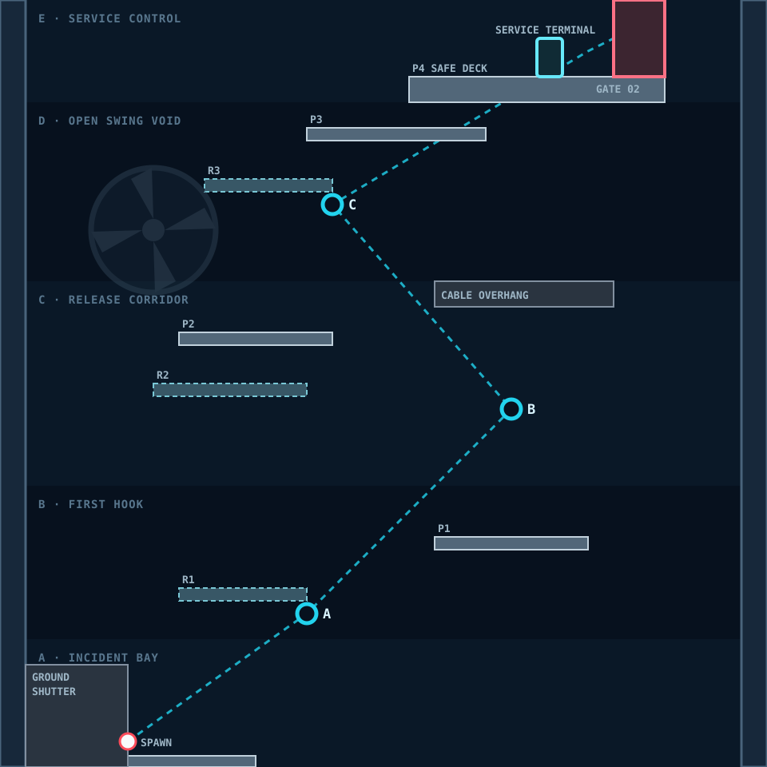

# SECTOR 01-1 — PRODUCTION ALIGNMENT

*IMPLEMENTATION · CAMERA · ART HANDOFF · REV 1.0*

본 문서는 [1-1 시나리오](./README.md)의 의도를 실제 Blockout과 화면 결과로 옮길 때 사용하는 짧은 제작 계약이다. 장문의 시나리오를 대체하지 않고, 서로 다른 자료가 충돌할 때 무엇을 따라야 하는지 정한다.

## 1. 현재 판정

| 항목 | 상태 | 판정 |
| --- | --- | --- |
| 기본 Rope만 학습 | `DECIDED` | Enemy, Wind, Augment, 즉사 Hazard 없음 |
| 960×960 Authored Geometry | `DECIDED` | Runtime Catalog와 승인 Blockout이 같은 좌표 사용 |
| A/B/C 추천 Anchor | `DECIDED` | 전용 Rope 모드가 아니라 추천 경로를 보여주는 Cyan Landmark |
| 기존 `01_gameplay_reference.png` | `RETIRED` | Turret이 있어 1-1 Gameplay·배치 기준으로 사용 금지 |
| 기존 `02_level_layout.png` | `RETIRED` | Turret과 Anchor 2개 구성이 REV 3.1과 충돌하므로 사용 금지 |
| Sector 01 배경 이미지 | `MOOD ONLY` | 색·조명·산업 밀도만 참고하고 지형 위치는 복제하지 않음 |
| Camera Shot 수치 | `PROTOTYPE` | 아래 후보로 구현한 뒤 데스크톱·모바일 플레이테스트로 조정 |
| 정식 Sprite·배경 Package | `PENDING` | 현재 Mock Shape와 절차형 배경을 교체할 제작 자산 필요 |

## 2. 자료 우선순위

1. 핵심 학습, 금지 요소, Story 의미는 [시나리오 README](./README.md)가 결정한다.
2. 실제 좌표와 충돌은 [`Sector01AreaCatalog.js`](../../../../../src/game/world/areas/sector01/Sector01AreaCatalog.js)의 `sector-01-01` 정의와 [승인 Blockout](./images/03_approved_blockout.svg)이 항상 일치해야 한다.
3. 두 자료가 다르면 어느 한쪽을 임의로 따라가지 않고 같은 변경에서 함께 수정한다.
4. [Sector 01 배경 레퍼런스](../README.md)는 분위기만 결정한다.
5. `RETIRED` 이미지는 아이디어 기록이며 구현·아트 검수 근거로 사용하지 않는다.

## 3. 승인 Blockout

좌표는 Stage Local World Unit이다. `X = -480~480`, `Y = 0~-960`이며 위로 갈수록 Y가 작아진다. 모든 수치는 현재 Runtime 정의와 같다.

### Collision Surface

| ID | X | Y | W×H | 속성 |
| --- | ---: | ---: | ---: | --- |
| P0 | -416 | 0 | 256×32 | 시작 발판, one-way |
| R1 | -256 | -224 | 160×16 | Recovery, one-way |
| P1 | 64 | -288 | 192×16 | 첫 Landing, one-way |
| R2 | -288 | -480 | 192×16 | Recovery, one-way |
| P2 | -256 | -544 | 192×16 | Release Landing, one-way |
| Cable Overhang | 64 | -608 | 224×32 | 비살상 Solid Collision |
| R3 | -224 | -736 | 160×16 | Recovery, one-way |
| P3 | -96 | -800 | 224×16 | Open Swing Landing, one-way |
| P4 | 32 | -864 | 320×32 | Terminal Safe Deck, one-way |
| Ground Shutter | -448 | -128 | 128×128 | 봉쇄된 Solid Collision |

### Gameplay Landmark와 진행

| ID | 위치 | 의미 |
| --- | --- | --- |
| Spawn | `(-320, -32)` | 즉시 조작 가능 |
| Anchor A | `(-96, -192)` | 첫 Attach |
| Anchor B | `(160, -448)` | Release Timing |
| Anchor C | `(-64, -704)` | 큰 Swing |
| Inactive Fan | `(-288, -672)` | 배경 전용, Wind·Damage 없음 |
| Service Terminal | `(208, -896)` | 상호작용 반경 72, `terminal-read` 완료 |
| Service Gate | `(320, -928)` | Terminal 완료 뒤 개방, 직접 통과 |
| Exit | `(320, -928)` | 같은 Run을 유지하며 1-2로 연결 |

### Anchor 해석 규칙

- Cyan A/B/C는 초보자에게 추천 궤적을 보여주는 Landmark다.
- 기존 Rope의 유효 Surface 부착 규칙은 유지한다.
- Landmark 중심에는 보이지 않는 24×24 비충돌 Grapple Target Surface가 있어 조준 의도를 보정한다.
- Anchor 중심 반경 64px에는 강한 Cyan 장식, 충돌 Pipe, 다른 조준 후보를 두지 않는다.
- 정식 Anchor Sprite의 빛이 실제 부착 가능 위치와 12px 이상 어긋나면 FAIL이다.

## 4. Camera Shot 계약

전체 세로 지도를 한 화면에 보여주는 이미지는 실제 Gameplay Shot이 아니다. 구현 검수는 아래 다섯 화면으로 한다.

| SHOT | Player Y 구간 | 반드시 한 화면에 보일 것 | Desktop Zoom | Mobile Zoom |
| --- | --- | --- | ---: | ---: |
| C01 Intro | `0~-176` | Player, Ground Shutter, A, P1 일부 | 1.25 | 0.82 |
| C02 First Hook | `-176~-352` | Player, A, P1, R1 | 1.20 | 0.80 |
| C03 Release | `-352~-608` | Player, B, P2, R2, Cable Overhang | 1.10 | 0.76 |
| C04 Open Swing | `-608~-832` | Player, C, P3, R3, 빈 Swing 공간 | 1.00 | 0.72 |
| C05 Terminal | `-832~-960` | Player, P4, Terminal, Gate | 1.15 | 0.78 |

수치는 첫 구현 후보이며 `PROTOTYPE`이다. Zoom 수치보다 “반드시 한 화면에 보일 것”이 우선한다. 보간은 현재 지수형 추적을 유지하고 별도 Cinematic Camera를 만들지 않는다.

### 화면 구도

- Intro에서 B가 강하게 보이면 A의 첫 학습이 약해지므로 B는 화면 밖이거나 배경보다 약해야 한다.
- B 구간에서는 Target P2와 Overhang을 동시에 보여줘 Release가 너무 늦었음을 이해시킨다.
- C 구간은 다른 Shot보다 넓게 보여 큰 진자운동의 공간을 확보한다.
- Terminal Shot에서는 Anchor Cyan보다 Terminal과 Gate 상태가 먼저 읽혀야 한다.

## 5. Story Trigger 계약

| EVENT | 조건 | 화면 문구 | 표시·반복 |
| --- | --- | --- | --- |
| `lockdown` | 1-1 최초 진입 | `GROUND SERVICE ACCESS / LOCKDOWN` | 1.8초, Run당 1회, 조작 중단 없음 |
| `terminal-read` | Terminal 상호작용 | `VERTICAL GRID / CASCADE FAILURE` → `LOWER TRANSIT / OFFLINE` → `ROOFTOP PAD 03 / MAINTENANCE SHUTTLE / STANDBY` | 각 0.9초, 이동 입력 허용 |
| `gate-open` | Terminal Sequence 완료 | `SERVICE SHAFT 02 / ACCESS OPEN` | 1.2초, Gate 상태와 동기화 |

멀티플레이에서 Story 문구는 각 플레이어 화면에 표시할 수 있지만 Objective와 Gate 개방은 공용 상태로 한 번만 처리한다.

## 6. 저비용 Art Package

완성 배경 한 장을 Stage 크기로 제작하지 않는다. 아래 재사용 모듈로 Sector 01 전체를 구성한다.

| LAYER | 1-1 최소 자산 | 배치 규칙 |
| --- | --- | --- |
| Far | Shaft Silhouette 2종, 원거리 Light 1종 | 느린 Parallax, Collision 없음 |
| Mid | 비활성 Fan 1종, Pipe Cluster 2종, Brace 1종 | 같은 모듈을 회전·반전·부분 가림으로 재사용 |
| Near | 32px Wall/Trim Tile, Warning Lamp, Cable Socket | 화면 가장자리만 프레이밍하고 이동 공간을 가리지 않음 |
| Gameplay | Platform Edge, Recovery Edge, Anchor, Terminal, Gate | Stable Object ID와 상태만 교체 |

권장 예산은 `1024×1024` 이하 공용 Tile Atlas 1장과 `512×512` 이하 배경 모듈 Atlas 1장이다. 비활성 Fan은 애니메이션하지 않으며, Orange Lamp와 Cyan 설비등은 동시에 화면에 각각 6개 이하로 제한한다.

## 7. Acceptance Capture

정식 아트로 넘어가기 전에 C01~C05를 다음 조건으로 캡처한다.

- Desktop: 1280×720
- Mobile: 390×844 세로 화면
- HUD on, Debug Collider off
- 같은 Seed와 같은 1-1 좌표 사용
- 각 Shot에서 Player, 다음 행동, 실패 복귀 지점을 확인

### PASS

- 다섯 Shot 모두 다음 행동을 Tutorial 문장 없이 찾을 수 있다.
- Turret, Wind Telegraph, Augment UI가 한 프레임도 나타나지 않는다.
- A/B/C, Landing, Recovery와 Terminal이 배경보다 먼저 읽힌다.
- 기존 `RETIRED` 이미지가 없어도 Blockout을 재현할 수 있다.
- `swingImpulse = 0` 검증과 현재값 검증을 모두 통과한다.

### FAIL

- 기존 이미지의 Turret이나 2-Anchor 구성을 재현한다.
- 배경 이미지 위치를 Collision 지형으로 그대로 복제한다.
- 전체 Stage 조감도와 실제 카메라 Shot을 같은 것으로 취급한다.
- 문서와 Runtime 좌표 중 하나만 수정해 둘이 어긋난다.

## 8. 현재 구현과 다음 작업

| 범위 | 현재 | 다음 작업 |
| --- | --- | --- |
| 지형·Anchor·Terminal·Gate | Runtime Mock 연결 완료 | 승인 Blockout과 자동 비교 유지 |
| Camera | 전 구간 공통 추적 | C01~C05 Zone Preset 연결 |
| Story | Stable Trigger 이름 보존 | 조건·문구·표시 시간을 Presentation에 연결 |
| 오브젝트 그래픽 | Mock Shape | 공용 Sector 01 Atlas로 교체 |
| 배경 | 저비용 절차형 산업 배경 | 재사용 Atlas가 준비되면 같은 Layer 경계에서 교체 |
| 데스크톱·모바일 캡처 | 대기 | C01~C05 Acceptance Capture 생성 |

다음 Stage 문서는 이 형식을 복제하되, 1-1의 좌표나 Camera 수치를 복사하지 않는다. `자료 판정 → 승인 Blockout → Camera Shot → Story/System Trigger → 저비용 자산 → Acceptance Capture` 순서만 공통으로 사용한다.

## 9. 증강·Story 연결

[Sector 01 증강·스토리 통합 기준](../AUGMENT-STORY-INTEGRATION.md)에 따라 1-1은 모든 Foundation Augment의 기준선이다.

- Augment 효과, 선택 UI, 관련 Tutorial을 노출하지 않는다.
- Player는 Rope를 아직 특수 능력이 아니라 사고 후 남은 Maintenance Tool로 이해한다.
- 첫 Attach 성공률, Release Landing률, Recovery 사용률을 기록해 증강 전 기본 조작 품질을 확인한다.
- 이후 증강이 추가되어도 현재 지형은 `foundationAugment = none`으로 완전히 통과 가능해야 한다.
- 1-1에서 Telemetry나 Profile 명칭을 먼저 설명하지 않는다. Story는 Lockdown, Grid Failure, 수직 탈출 목표만 전달한다.
- 기본 Rope 수치를 증강으로 옮기는 변경은 이 Stage와 1-2의 A/B/C 비교를 통과하기 전까지 `HYPOTHESIS`로 유지한다.
