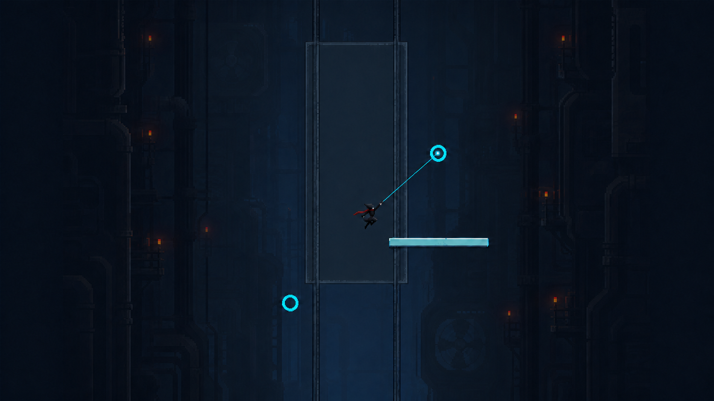
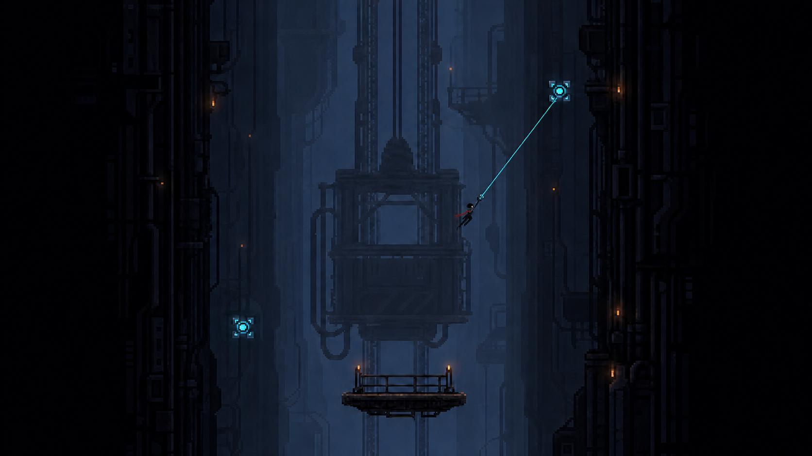
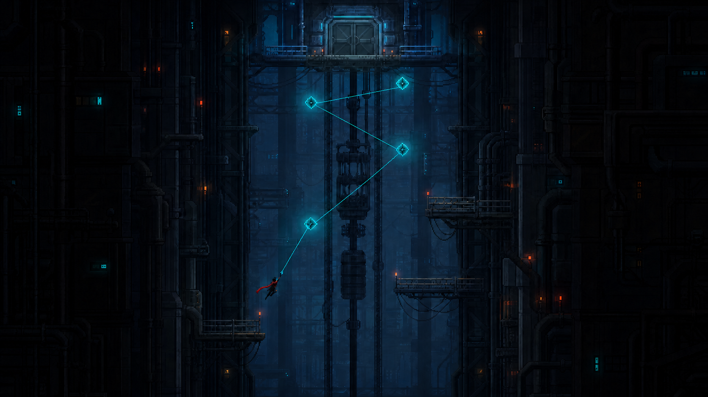
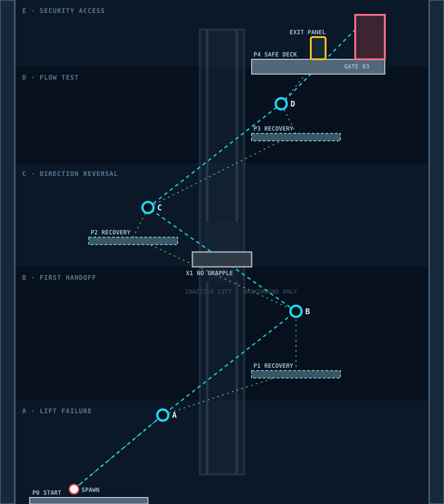

# SECTOR 01-2 — PRODUCTION ALIGNMENT

*IMPLEMENTATION · CAMERA · ART HANDOFF · REV 1.0*

본 문서는 [1-2 시나리오](./README.md)를 실제 화면으로 옮기는 제작 계약이다. `APPROVED BLOCKOUT`은 좌표를, `SCENARIO ART REFERENCE`는 최종 화면의 분위기와 정보 위계를 담당한다.

## 1. 현재 판정

| 항목 | 상태 | 판정 |
| --- | --- | --- |
| A→B→C→D 공중 Grapple 연결 | `DECIDED` | 중간 착지 없는 Flow Route와 Recovery를 쓰는 Safe Route 모두 제공 |
| Enemy·Damage Hazard·Wind·Augment 없음 | `DECIDED` | 첫 Enemy는 1-3에서 소개 |
| 960×1088 Authored Geometry | `DECIDED` | Runtime Catalog와 승인 Blockout이 같은 좌표 사용 |
| `03_scenario_art_reference.png` | `RETIRED` | 전체 Anchor 경로선과 Stage 전체 구도로 live Rope·Camera Shot 의미가 불일치 |
| `04_approved_blockout.svg` | `APPROVED BLOCKOUT` | 플랫폼·Anchor·Recovery·Crossbeam·Gate의 배치 기준 |
| `05_scenario_art_reference.png` | `RETIRED / STRUCTURE MISMATCH` | P1이 A보다 아래에 보여 Runtime·Blockout의 수직 관계와 불일치 |
| `06_scenario_art_reference.png` | `APPROVED ART REFERENCE` | C02의 B 위·P1 중간·A 아래 구조, Player·B live Rope·정지 Lift 기준 |
| 기존 `01_swing_line.png` | `RETIRED PARTIAL` | Anchor 3개만 보여 현재 A→B→C→D 구조와 불일치 |
| 기존 `02_level_layout.png` | `RETIRED` | Turret·Terminal이 있어 1-2 금지 요소와 충돌 |
| Camera Shot 수치 | `PROTOTYPE` | 데스크톱·모바일 실기 테스트 후 수치만 조정 |

## 2. 자료 우선순위

1. 핵심 학습, 금지 요소, Story 의미는 [시나리오 README](./README.md)가 결정한다.
2. 실제 좌표와 충돌은 [`Sector01AreaCatalog.js`](../../../../../src/game/world/areas/sector01/Sector01AreaCatalog.js)의 `sector-01-02` 정의와 [승인 Blockout](./images/04_approved_blockout.svg)이 항상 일치해야 한다.
3. [Scenario Art Reference](./images/06_scenario_art_reference.png)는 [Scenario Art 생성 규격](../../SCENARIO-ART-GENERATION-STANDARD.md)에 따라 C02 `first-handoff` Runtime과 승인 Blockout에서 구조 가이드를 만든 대표 Gameplay Shot이다.
4. 기존 `01`, `02`, `03` PNG는 기록용이며 구현·외주·새 생성 입력에 첨부하지 않는다.
5. 새 이미지와 Runtime의 오브젝트 수·Camera 정보가 다르면 이미지를 따라가지 않고 같은 변경에서 문서를 정렬한다.

## 3. 문서 이미지

### Scenario Art Reference

`APPROVED ART REFERENCE`: C02 `first-handoff`, local Player Y `-512~-224`, Desktop Zoom `1.0`을 사용한다. B는 오른쪽 위, P1은 B 아래·A 위의 오른쪽 Recovery, A는 왼쪽 아래라는 Camera-space 구조를 고정한다. 약 48px Player, inactive Anchor A와 current Anchor B 두 개, Player의 Grapple Arm에서 B로 이어지는 live Cyan Rope 한 줄과 정지한 Maintenance Lift를 포함한다. Anchor C/D·Crossbeam·Enemy·Wind·Augment·Panel·Gate와 전체 Route 선은 포함하지 않는다.

이 이미지는 World 좌표나 Collision의 권위 자료는 아니지만 선택한 C02 Shot에서 보이는 B·P1·A의 좌우·상하 관계와 P1 상대 폭은 Runtime과 일치해야 한다. 생성 기록과 사후 검수 결과는 [`images/README.md`](./images/README.md)에 보존한다.

### 이전 Art Reference

`RETIRED / STRUCTURE MISMATCH`: P1이 A보다 아래에 보여 실패 Recovery의 위치를 잘못 전달한다. 환경 분위기 기록으로만 보존하고 새 생성·구현·외주·검수 기준으로 사용하지 않는다.

`RETIRED`: 환경 분위기 기록으로만 보존한다. Anchor 전체를 연결한 선과 Stage 전체 구도는 실제 C02 Gameplay Camera와 live Rope 의미에 맞지 않으므로 새 생성·구현·외주·검수 기준으로 사용하지 않는다.

### Approved Blockout

좌표는 Stage Local World Unit이다. `X = -480~480`, `Y = 0~-1088`이며 위로 갈수록 Y가 작아진다.

## 4. Runtime Geometry

### Collision Surface

| ID | X | Y | W×H | 속성 |
| --- | ---: | ---: | ---: | --- |
| P0 | -416 | 0 | 256×32 | 시작 발판, one-way |
| P1 | 64 | -288 | 192×16 | 첫 Recovery, one-way |
| Crossbeam X1 | -64 | -544 | 128×32 | Solid, Rope 부착 불가 |
| P2 | -288 | -576 | 192×16 | 방향 전환 Recovery, one-way |
| P3 | 64 | -800 | 192×16 | Flow Recovery, one-way |
| P4 | 64 | -960 | 288×32 | Exit Safe Deck, one-way |

### Landmark와 진행

| ID | 위치 | 의미 |
| --- | --- | --- |
| Spawn | `(-320, -32)` | 즉시 조작 가능 |
| Anchor A | `(-128, -192)` | 1-1 복습 |
| Anchor B | `(160, -416)` | 첫 Airborne Handoff |
| Anchor C | `(-160, -640)` | 방향 반전 |
| Anchor D | `(128, -864)` | Flow 확인 |
| Maintenance Lift | `(0, -544)` | 배경 전용, 이동·충돌 없음 |
| Exit Panel | `(208, -960)` `bottom-center` | P4 바닥에 세우고 도달 뒤 활성화, 반경 72 |
| Security Access Gate | `(320, -960)` `bottom-center` | P4 바닥에 세우고 Panel 조작 뒤 열어 1-3으로 연결 |

Recovery 중심은 P1 `(160, -312)`, P2 `(-192, -600)`, P3 `(160, -824)`다. 실패한 Handoff만 3~5초 안에 다시 시도하게 하고 Stage 시작으로 떨어뜨리지 않는다.

`route-exit (288, -1024)`와 논리 `area.exit (320, -1056)`은 진행·카메라 기준점이며 바닥 설치 오브젝트의 좌표가 아니다. Gate 포탈 판정은 `(320, -960)`을 하단 중앙으로 삼은 실제 문 개구부만 사용한다.

### Anchor 해석 규칙

- A/B/C/D는 전용 Rope Mode가 아니라 추천 연결 지점을 보여주는 Cyan Landmark다.
- Landmark 중심의 24×24 Target은 비충돌이며 기존 Surface 부착 규칙을 막지 않는다.
- 각 중심 반경 64px에는 다른 Cyan 장식, 충돌 Pipe, 경쟁 조준 후보를 두지 않는다.
- 정식 Sprite 중심과 실제 부착 위치의 오차는 12px 이하로 유지한다.
- Crossbeam X1은 충돌하지만 Rope 후보가 아니며, 이 차이가 외형으로 읽혀야 한다.

## 5. Camera Shot 계약

| SHOT | Player Y 구간 | 반드시 한 화면에 보일 것 | Desktop Zoom | Mobile Zoom |
| --- | --- | --- | ---: | ---: |
| C01 Lift Failure | `0~-224` | Player, 고장 난 Lift 하부, A, P1 일부 | 1.20 | 0.80 |
| C02 First Handoff | `-224~-512` | A, B, Player, P1 | 1.00 | 0.72 |
| C03 Direction Reversal | `-512~-736` | B, C, P2, Crossbeam X1 | 0.95 | 0.70 |
| C04 Flow Test | `-736~-944` | C, D, P3, 위쪽 P4 일부 | 1.00 | 0.72 |
| C05 Exit | `-944~-1088` | D, P4, Exit Panel, Gate | 1.15 | 0.78 |

수치는 `PROTOTYPE`이며 표시 대상이 우선한다. 별도 Cinematic Camera나 Stage 전체 Zoom-out을 추가하지 않고 현재 추적과 보간을 유지한다.

- First Handoff Shot에서는 B가 Release 이전에 보여야 한다.
- Direction Reversal Shot에서는 B→C 궤적과 Crossbeam의 관계가 동시에 읽혀야 한다.
- Flow Test Shot에서 Exit Panel은 아직 강조하지 않고 D를 마지막 Rope 목표로 읽히게 한다.
- Exit Shot에서는 Anchor Cyan보다 Panel의 준비 상태와 Gate가 먼저 읽힌다.

## 6. Story Trigger 계약

| EVENT | 조건 | 화면 문구 | 표시·반복 |
| --- | --- | --- | --- |
| `lift-offline` | 1-2 최초 진입 | `LIFT CONTROL / OFFLINE` | 1.6초, Run당 1회, 조작 유지 |
| `manual-access-only` | A가 처음 화면에 들어옴 | `AUTOMATIC LIFT SERVICE / SUSPENDED / MANUAL ACCESS ONLY` | 1.8초, Run당 1회 |
| `power-reduction-stage-2` | P4 최초 도달 | `POWER REDUCTION / STAGE 2` | 1.2초, Run당 1회 |
| `security-access-check` | Exit Panel 준비 | `SECURITY ACCESS / CHECK` | Panel 상태와 동기화 |

강제 Cutscene과 입력 차단은 사용하지 않는다. 멀티플레이에서 문구는 개인 표시가 가능하지만 P4 Objective와 Gate 상태는 공용으로 한 번만 처리한다.

## 7. 저비용 Art Package

새 Art Reference를 통이미지 Runtime 배경으로 사용하지 않는다. 다음 모듈을 Sector 01 공용 Atlas에서 재사용한다.

| LAYER | 최소 자산 | 배치 규칙 |
| --- | --- | --- |
| Far | 수직 Shaft Silhouette 2종, 원거리 작업등 | 느린 Parallax, Collision 없음 |
| Mid | Lift Cage 1종, Rail 1종, Counterweight 1종, Cable 2종 | 중앙 세로 Landmark로 반복 조합 |
| Near | 32px Wall/Trim, Brace, 작은 Panel | 화면 가장자리만 프레이밍 |
| Gameplay | Platform Edge, Recovery Edge, Anchor, Crossbeam, Panel, Gate | Stable ID와 상태를 유지하며 Mock 교체 |

1-1과 같은 `1024×1024` 이하 공용 Tile Atlas와 `512×512` 이하 배경 모듈 Atlas를 사용한다. Lift는 정지 상태이므로 애니메이션을 만들지 않는다. 화면 밖 Cable, Lamp, 배경 Layer는 갱신하지 않는다.

## 8. Acceptance Capture

- Desktop 1280×720과 Mobile 390×844에서 C01~C05 캡처
- HUD on, Debug Collider off
- 같은 World Definition과 같은 1-2 좌표 사용
- Safe Route와 무착지 Flow Route를 각각 1회 기록

### PASS

- A→B→C→D 순서를 Tutorial 문장 없이 찾을 수 있다.
- Safe Route는 각 실패 뒤 5초 안에 같은 Handoff를 재시도한다.
- Flow Route는 중간 Landing 없이 완주 가능하다.
- Enemy, Turret, Projectile, Wind, Damage Telegraph가 한 프레임도 나타나지 않는다.
- Crossbeam은 Anchor로 오인되지 않는다.
- Art Reference의 Player/Rope/Anchor 정보 위계가 실제 화면에서도 유지된다.

### FAIL

- 기존 3-Anchor 이미지를 따라 D가 누락된다.
- 기존 Turret 이미지를 따라 적이나 Terminal을 배치한다.
- Art Reference의 Platform 위치를 Runtime Collision으로 복제한다.
- `03_scenario_art_reference.png`의 전체 Anchor 연결선이나 Stage 전체 구도를 새 화면에 복제한다.
- B가 Release 전에 보이지 않아 첫 Handoff가 추측 입력이 된다.
- 문서와 Runtime 좌표 중 하나만 변경한다.

## 9. 증강·Story 연결

[Sector 01 증강·스토리 통합 기준](../AUGMENT-STORY-INTEGRATION.md)에 따라 1-2는 증강을 제공하는 Stage가 아니라, 이후 증강의 이유가 되는 Rope Telemetry를 만드는 Stage다.

- Foundation Augment는 아직 `none`이며 효과·선택 UI·보정 VFX를 노출하지 않는다.
- A→B→C→D의 Attach 간격, Release 뒤 다음 Attach 성공률, Recovery 사용률을 기록한다.
- 이 기록은 1-4에서 `Relay Link`만 정답으로 추천하기 위한 점수가 아니라 세 가지 Firmware Profile을 생성하는 공통 진단 자료다.
- `rope-telemetry-start`는 첫 공중 Re-Attach에서 조용히 기록할 수 있지만 Player에게 능력 선택을 예고하는 설명창은 띄우지 않는다.
- 1-3 Security는 이 비정상적인 Manual Route를 `route-violation`으로 해석하며, 그 결과가 1-4 Maintenance Node 진단으로 이어진다.
- Relay 후보 수치는 증강 없는 전환 성공률을 측정한 뒤에만 적용한다. 현재 1-2 지형 자체를 Relay 전용으로 만들면 FAIL이다.

## 10. 다음 작업

| 범위 | 현재 | 다음 작업 |
| --- | --- | --- |
| 지형·Anchor·Gate | Runtime Mock 연결 완료 | 승인 Blockout과 좌표 동기화 유지 |
| Camera | 전 구간 공통 추적 | C01~C05 Zone Preset 연결 |
| Story | Trigger 이름 보존 | 조건·문구·표시 시간을 Presentation에 연결 |
| 그래픽 | 구조 정합 C02 First Handoff 대표 Shot 승인 | 공용 Atlas용 Lift·Rail·Cable 모듈 제작, Player Character Master 승인 시 실루엣 재검수 |
| 플레이테스트 | 자동 월드 검증 완료 | Safe/Flow Route와 공중 Attach 성공률 측정 |

다음 Stage의 이미지도 `Scenario Art Reference + Approved Blockout` 역할을 분리하고, 생성 직전 해당 Runtime의 Camera·오브젝트·구현 상태를 확인한다.
