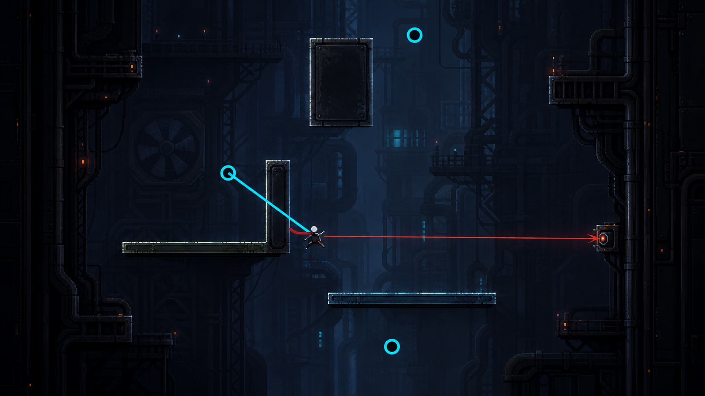
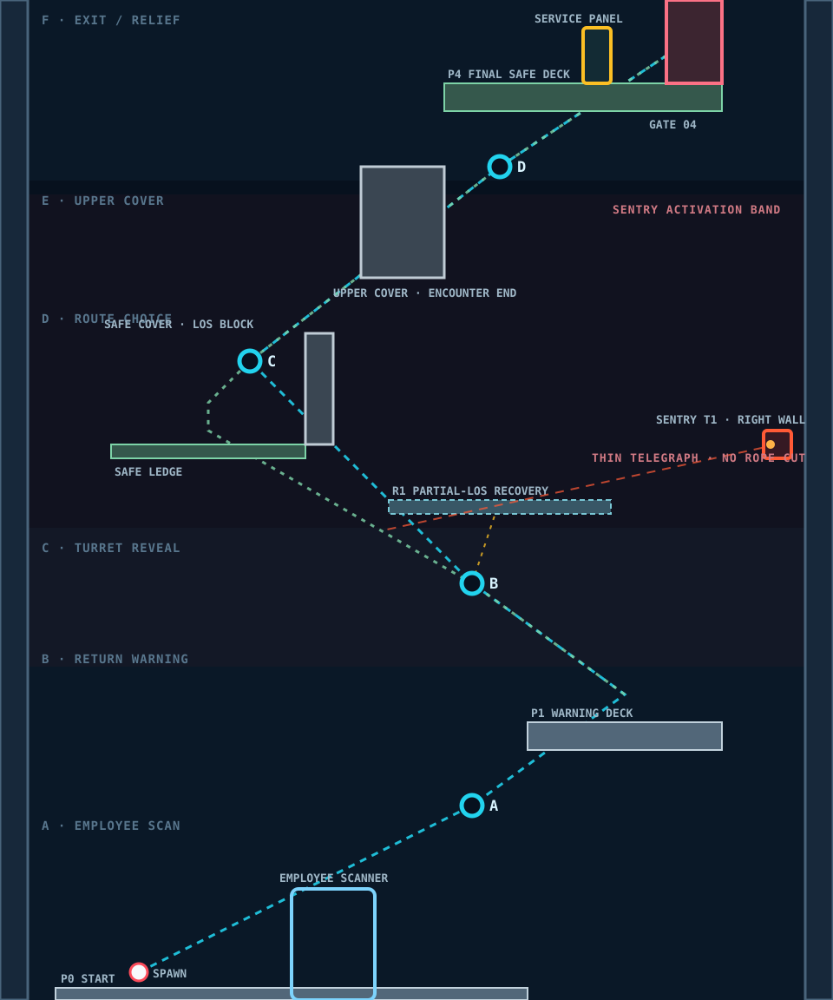

# SECTOR 01-3 — SECURITY CHECK

*BLOCKOUT CANDIDATE · REV 3.0*

◀ PREV — [SECTOR 01-2 / DOUBLE ANCHOR SHAFT](../1-2/README.md) · NEXT — [SECTOR 01-4 / MAINTENANCE NODE](../1-4/README.md) ▶

> 실제 Runtime 좌표·Camera·Sentry 상태·Asset 인계 기준은 [PRODUCTION-ALIGNMENT.md](./PRODUCTION-ALIGNMENT.md)를 함께 따른다.

Sector: 01 MAINTENANCE
Stage: 03
Theme: Automated Maintenance Security Check
Difficulty: ★★
Expected First Playtime: 100~150 sec

Primary Mechanic:
Movement Under Telegraph Pressure

New Gameplay Element:
Sentry Turret

Combat Requirement:
REQUIRED ACCESS CARRIER (SECTOR 3-OF-3)

Damage Hazard:
Sentry Projectile

Augment:
NONE

Wind:
NONE

Required Previous Knowledge:
- Attach
- Swing
- Release
- Landing
- Airborne Re-Attach
- Grapple Chaining

---

## 1. 한 줄 정의

정상 직원으로 인증된 정비기사가 봉쇄 명령을 무시하고 위쪽으로 계속 이동하자,
도시 보안 시스템이 처음으로 플레이어를
`UNAUTHORIZED VERTICAL TRANSIT` 상태로 판정한다.

플레이어는 처음 등장한 Sentry Turret의 명확한 공격 예고를 읽으며
1-2에서 배운 연속 Grapple을 유지해 위험 구간을 돌파한다.

핵심 플레이 문장:

SEE WARNING
→ KEEP MOVING
→ ATTACH
→ SWING
→ DODGE SHOT
→ RE-ATTACH
→ LEAVE TURRET LOS

---

## 2. 전체 게임에서의 역할

### 1-1

기본 Rope

Attach
→ Swing
→ Release
→ Landing

### 1-2

연속 Rope

Release
→ Airborne Re-Attach
→ Grapple Chain

### 1-3

처음으로:

"Rope를 사용하는 동안 나를 방해하는 존재"

등장.

새 학습:

- Red Telegraph는 곧 공격이 온다는 의미
- 계속 움직이면 공격을 피할 수 있음
- Rope 이동 자체가 회피 행동이 됨
- 0.41.0의 Sector 3-of-3 계약에서 이 Carrier는 필수다(1-3·1-6·1-7 세 기를 모두 처치해야 Sector 경계 개방).
- 멈추는 경로와 계속 이동하는 경로가 다른 위험을 가짐

---

## 3. 1-3에서 배우지 않는 것

DO NOT INTRODUCE:

- Wind
- Moving Platform
- Laser
- Rope Cutter
- Grapple Jammer
- Drone
- Multiple Enemy Types
- Augment
- Maintenance Node
- Boss
- Instant Death Hazard
- Complex Combat Input

1-3의 새 질문은 하나뿐이다.

"위험을 읽으면서 Rope 흐름을 유지할 수 있는가?"

---

## 4. 레퍼런스에서 가져온 설계 원칙

### SANABI → TRANSFER

Chain-hook 이동과 적의 위협을 별개의 게임처럼 분리하지 않는다.

우리 적용:

Turret의 공격을 피하기 위해
별도 Dodge Button을 추가하지 않는다.

기존 Rope 이동 자체가 회피 수단이 된다.

---

### Rusted Moss → TRANSFER

하나의 공간 문제에 하나의 정답만 강제하지 않는다.

우리 적용:

같은 Turret 구간에

- SAFE ROUTE
- FLOW ROUTE
- RECOVERY ROUTE

를 동시에 제공한다.

---

### Celeste → TRANSFER

어려움은 유지하되
플레이어가 이해하지 못한 실패를 줄인다.

우리 적용:

- 첫 shot은 피하기 쉬움
- 첫 피격은 치명적이지 않음
- 추락해도 가까운 Recovery에서 재시도
- 다음 Anchor를 공격 전에 보여줌
- Telegraph를 충분히 명확하게 제공

---

### N → TRANSFER

Enemy behavior는 복잡한 AI보다
예측 가능한 상태 변화로 이해할 수 있어야 한다.

우리 적용:

Sentry Turret을 명확한 FSM으로 구성.

IDLE
→ ACQUIRE
→ TRACK
→ LOCK
→ FIRE
→ COOLDOWN

---

## 5. 스토리 역할

1-1:

사고 발생
+
Rooftop Maintenance Shuttle 확인.

1-2:

정상 Lift 사용 불가 확인.

1-3:

도시 시스템이 처음으로
플레이어의 이동 자체를 문제 행동으로 판정.

중요:

아직 플레이어는

HOSTILE
CRIMINAL
TARGET FOR TERMINATION

이 아니다.

시스템 관점에서는:

NON-COMPLIANT EMPLOYEE

정도다.

따라서 초반 Security 행동도
군사 작전이 아니라 시설 봉쇄 절차처럼 보여야 한다.

---

## 6. Story Sequence

입구 Scanner:

EMPLOYEE VERIFIED

EMPLOYEE CLASS:
VERTICAL MAINTENANCE

ASSIGNED SECTOR:
LOWER MAINTENANCE

플레이어가 위로 이동.

첫 경고:

RETURN TO ASSIGNED SECTOR

계속 상승.

두 번째 Trigger:

ROUTE VIOLATION DETECTED

이후:

UNAUTHORIZED VERTICAL TRANSIT

Turret 활성.

Level 최상단 Gate:

ACCESS DENIED

RETURN TO ASSIGNED SECTOR

Player Service Panel Interaction:

MAINTENANCE OVERRIDE

Gate Open.

마지막 System Message:

VIOLATION LOGGED

이 이벤트가 1-4 Maintenance Node로 연결된다.

---

## 7. 공간 콘셉트

공간:

AUTOMATED MAINTENANCE SECURITY CHECK SHAFT

정비구역 사이에 존재하는
작업자 ID / 이동권한 검사 시설.

1-2의 Lift Shaft보다 조금 넓어진다.

대표 구조물:

- Security Scanner Frame
- Automated Sentry Housing
- Inspection Catwalk
- Security Conduit
- Vertical Blast Gate
- Employee Access Signage

1-2까지의 공간은:

"기계 설비"

였다면

1-3부터 처음:

"이 도시가 사람을 관리하는 시스템"

이 보이기 시작한다.

---

## 8. Pixel / Grid 기준

Base Grid:

32×32 px

Player Game Output:

48×48 px

Sentry Turret:

32×32 px active body

Folded State:

32×16 ~ 32×24 px

Grapple Anchor:

24×24 px recommended

Thin Platform:

32×16 px

Standard Platform:

32×32 px

Scanner Structure:

96×128 또는
128×128 px

Security Gate:

64×96 ~ 96×128 px

Service Panel:

32×64 px

Stage Width:

3840 px (960px 기존 보안 spine + 오른쪽 Access Annex)
= 30 tiles

Stage Height:

1152 px
= 36 tiles

Coordinate:

X = -480 ~ +480
Y = 0 ~ -1152

---

## 9. 전체 맵 구조

SYMBOL

●     = Recommended Grapple Anchor
[T]   = Sentry Turret
S     = Scanner
██    = Solid Cover
════  = Main Platform
----  = Thin / Recovery Platform
PANEL = Service Panel

                         Y -1152

        ┌────────────────────────────────────┐
        │                      GATE 04 →     │
        │                █████████████       │
        │                SECURITY GATE       │
        │                         PANEL      │
        │                                    │
        │                  P4 FINAL DECK     │
        │            ═══════════════════     │
        │                       ↑            │
        │                    ● D             │
        │                   ╱                │
        │          █████████                 │
        │          COVER WALL C1             │
        │                                    │
        │        ● C                         │
        │          ╲                         │
        │           ╲        FLOW ROUTE      │
        │            ╲                       │
        │                                    │
        │    SAFE LEDGE S1      [ T1 ]       │
        │  ═════════════██        ╲          │
        │               ██         ╲ LOS     │
        │                           ╲         │
        │             ● B            ╲       │
        │            ╱                       │
        │                                   │
        │       ---- RECOVERY R1 ----        │
        │                                    │
        │                P1                  │
        │          ═════════════             │
        │               ↑                    │
        │             ● A                    │
        │                                    │
        │         [ SECURITY SCANNER ]       │
        │                  S                 │
        │                                    │
        │ P0 START                           │
        │ ═════════════════                  │
        └────────────────────────────────────┘

                          Y 0

전체 이동 Spine:

START
→ SCANNER
→ A
→ P1
→ B
→ C
→ COVER WALL
→ D
→ PANEL
→ GATE

---

## 10. Stage Zone 구성

ZONE A
IDENTIFICATION

Y:
0 ~ -224

목적:
플레이어가 정상 직원임을 보여줌.

---

ZONE B
FINAL WARNING

Y:
-224 ~ -416

목적:
기본 Grapple 복습.
아직 공격 없음.

---

ZONE C
TURRET INTRODUCTION

Y:
-416 ~ -672

목적:
Telegraph 언어 학습.

---

ZONE D
ROUTE CHOICE

Y:
-672 ~ -928

목적:
Safe / Flow / Recovery 분기.

---

ZONE E
LOS BREAK / OVERRIDE

Y:
-928 ~ -1152

목적:
위협 종료.
스토리 진행.
1-4 연결.

---

## 11. 주요 오브젝트 좌표 초안

모든 수치는 BLOCKOUT HYPOTHESIS.

플레이테스트 후 수정.

---

### PLAYER SPAWN

position:
(-320, -32)

---

### P0 — START PLATFORM

bounds:

x = -416 ~ +128
y = 0

size:

544×32 px

role:

- 짧은 Walking 공간
- Security Scanner 통과
- Story Trigger
- 위쪽 Anchor A 확인

collision:
true

---

### SCANNER S1

position:

(-96, -64)

visual size:

96×128 px

role:

직원 신원 인증.

collision:

frame only

damage:

false

interactable:

false

automatic trigger:
true

display:

EMPLOYEE VERIFIED

ASSIGNED SECTOR:
LOWER MAINTENANCE

visual:

- dark frame
- thin scanning line
- white / dim cyan system text

IMPORTANT:

Scanner beam은 Danger Red처럼 보이면 안 됨.

Scanner와 Turret Telegraph의 색 언어를 구분.

---

## 12. ANCHOR A — SAFE REVIEW

position:

(+64, -224)

visual:

24×24 px

role:

1-2 기본기 짧은 복습.

difficulty:

VERY EASY

required:
true

A에서 아직 Enemy Attack 없음.

---

## 13. P1 — WARNING PLATFORM

bounds:

x = +128 ~ +352
y = -320

size:

224×32 px

role:

- Anchor A Landing
- Turret 등장 전 마지막 완전 안전 플랫폼
- 시스템 Warning 발생 위치

Player가 P1에 착지하면:

RETURN TO ASSIGNED SECTOR

표시.

P1에서는 Turret이 보이지만 아직 접혀 있음.

---

## 14. TURRET T1

position:

(+416, -640)

mount:

RIGHT WALL

visual:

32×32 px active

folded:

32×16~24 px

role:

첫 적.

목적:

플레이어를 죽이는 것보다
계속 움직이게 만드는 것.

---

## 15. Turret이 P1 바로 옆에 없는 이유

P1에서 Turret까지 충분한 거리를 둔다.

목적:

- 등장 전에 플레이어가 Turret 형태를 볼 수 있음
- Player Auto Weapon이 즉시 Turret을 삭제하는 상황 감소
- 첫 사격 전에 공간을 읽을 시간 제공
- 첫 Encounter가 Combat DPS Check가 되는 것 방지

P1은 관찰 공간.

실제 공격 구간은 B 이후.

---

## 16. TURRET ACTIVATION TRIGGER

trigger bounds:

Y ≈ -384

Player가 P1 위쪽으로 이동하면 발동.

Sequence:

ROUTE VIOLATION DETECTED

0.3~0.5 sec

UNAUTHORIZED VERTICAL TRANSIT

Turret housing opens.

기계 전개음.

Red Sensor 활성.

---

## 17. Sentry Turret State Machine

현재 일반 Enemy 즉발 시스템을
그대로 첫 Turret에 사용하지 않는다.

SENTRY FSM:

IDLE

↓

ACQUIRE

↓

TRACK

↓

LOCK

↓

FIRE

↓

COOLDOWN

↓

TRACK

---

## 18. Turret Timing — Initial Hypothesis

정확한 값은 플레이테스트 대상.

ACQUIRE:

0.25 sec

내용:

- Turret 전개
- Sensor on
- 아직 Aim Line 없음

---

TRACK:

0.70~0.90 sec

내용:

- 얇은 Red Aim Line
- Player를 따라 움직임

---

LOCK:

0.15~0.25 sec

내용:

- Aim Line 밝아짐
- Tracking 중지
- 마지막 방향 고정

이 짧은 순간이 Dodge Window.

---

FIRE:

1 projectile

현재 baseline projectile speed에서 시작.

---

COOLDOWN:

1.2~1.5 sec 정도에서 시작.

이후 다시 TRACK.

---

## 19. Telegraph Visual Language

IDLE:

- sensor off
- folded silhouette

ACQUIRE:

- small red eye
- mechanical unfold

TRACK:

- thin dark-red line

LOCK:

- bright red line
- small muzzle charge

FIRE:

- orange/red muzzle flash
- projectile

COOLDOWN:

- red eye dim
- no aim line

색깔만으로 구분하지 않는다.

Turret:

- 자세
- barrel direction
- line
- sound

까지 함께 사용.

---

## 20. Telegraph Sound

ACQUIRE:

mechanical unfold

TRACK:

low electronic tone

LOCK:

tone rises / short confirmation beep

FIRE:

sharp mechanical shot

COOLDOWN:

servo reset

Player가 화면 밖 Turret도
상태를 대략 판단할 수 있어야 함.

---

## 21. 첫 Shot 설계

첫 Shot의 목적:

플레이어를 맞히는 것

이 아니라

"Red Aim Line → 잠시 후 Projectile"

이라는 언어를 학습시키는 것.

따라서 첫 Shot은
계속 위쪽으로 움직이는 플레이어가 거의 자연스럽게 피하도록 한다.

이상적 플레이:

Aim Line appears

↓

Player sees Anchor B

↓

Player attaches B

↓

Swing begins

↓

LOCK

↓

Projectile fires at old/locked trajectory

↓

Player already moved

↓

MISS

첫 반응:

"움직이니까 피했다."

여야 한다.

---

## 22. ANCHOR B — MOVEMENT UNDER FIRE

position:

(+64, -480)

visual:

24×24 px

role:

첫 공격 상황에서 사용하는 Grapple.

difficulty:

EASY

required:
true

Player는 P1에서 B를 쉽게 잡을 수 있어야 한다.

B 자체를 찾는 데 어려움이 생기면
Enemy Tutorial과 Rope Tutorial이 충돌한다.

---

## 23. B 주변 Clean Zone

Anchor B 중심:

약 128~160px

내에는 불필요한 Collision Surface를 배치하지 않는다.

이유:

- Wrong Attach 방지
- Enemy Pressure 상황에서 Aim 난도 증가 방지
- 다음 행동 즉시 판독

배경 Pipe는 가능하지만:

NON-COLLISION
LOW CONTRAST

이어야 한다.

---

## 24. 첫 공격 구간의 실제 질문

Player가 B에 붙으면 Turret이 다시 TRACK.

이 구간에서 게임이 묻는 것:

"멈출 것인가,
계속 이동할 것인가?"

Flow가 빠를수록 안전하다.

하지만 빠른 플레이를 강제하지 않는다.

---

## 25. ANCHOR C — FLOW TARGET

position:

(-192, -736)

visual:

24×24 px

role:

B에서 공중 Re-Attach하는 숙련 Route Target.

B→C:

1-2에서 배운 연속 Grapple을
처음으로 실제 위협 속에서 사용.

difficulty:

MEDIUM

required for Flow:
true

Safe Route에서는 Platform을 거쳐 C 접근 가능.

---

## 26. SAFE LEDGE S1

bounds:

x = -352 ~ -128
y = -640

size:

224×16 px

right edge:

Cover Wall 포함.

role:

- 초보자용 휴식
- Turret 상태 관찰
- C 재조준
- Safe Route

---

## 27. SAFE LEDGE COVER WALL

position:

x = -128 ~ -96

height:

96~128 px

width:

32 px

role:

Turret LOS 차단.

중요:

Safe Ledge 전체가 완전히 안전한 bunker가 되면 안 됨.

구조:

왼쪽 2/3:

SAFE

오른쪽 1/3:

EXPOSED TRANSITION

즉 Player는:

안전하게 숨음

→ Turret Cycle 확인

→ Cover 밖으로 나옴

→ C Attach

가능.

---

## 28. SAFE ROUTE

P1
→ B
→ Safe Ledge
→ Cover behind
→ Wait for Turret Shot
→ Move out
→ C
→ D
→ Exit

특징:

- 쉬움
- 느림
- 안전함
- Turret Cycle을 관찰하게 함

---

## 29. FLOW ROUTE

P1
→ B
→ Swing
→ Release
→ Airborne Attach C
→ D
→ Exit

특징:

- 빠름
- 1-2 숙련도를 보상
- Turret 사선 안에 머무는 시간이 짧음
- 공격을 피하기 위한 별도 행동 불필요

핵심:

"잘 움직이는 것이 곧 방어."

---

## 30. RECOVERY R1

bounds:

x = -32 ~ +224
y = -576

size:

256×16 px

role:

B→C 또는 Safe Ledge 이동 실패 Catch.

danger:

PARTIAL

R1은 Turret LOS에 일부 노출.

즉:

실패해도 죽지 않지만
가만히 서 있을 수는 없음.

Player 선택:

R1
→ B 재Attach

또는

R1
→ C 직접 접근
(거리 허용 시)

Blockout에서 테스트 후 결정.

---

## 31. Recovery 설계 의도

실패 비용은 낮게 유지.

하지만 Recovery가 더 좋은 Shortcut이 되면 안 됨.

목표:

FAIL
→ RECOVER
→ RETRY

약 3~6 sec.

NOT:

FAIL
→ LEVEL RESET

---

## 32. Turret LOS

Turret position:

(+416, -640)

기본 사격 영역:

샤프트 중앙 및 왼쪽 방향.

Turret은 360도 완전 자유조준하지 않는 것을 권장.

Recommended Arc:

약 120~150 degree

이유:

- 안전영역을 공간적으로 설계 가능
- 플레이어가 Turret 방향을 보고 위험 영역 추론 가능
- Cover 설계 의미 발생
- 첫 적이 너무 전능하게 느껴지지 않음

---

## 33. LOS Design

Turret이 공격 가능한 영역:

- P1 상부
- B Swing corridor
- Recovery R1 일부
- Safe Ledge 진입부
- B→C Open Void

공격하지 못하는 영역:

- Safe Ledge Cover 뒤
- C 상부 Cover Wall 이후
- Final Deck

즉 공간을 올라갈수록:

DANGER
→ DANGER
→ TEMP SAFE
→ DANGER
→ SAFE

의 리듬.

---

## 34. COVER WALL C1

위치:

C 이후 상단.

recommended:

x = -64 ~ +32
y ≈ -832 ~ -960

size:

96×128 또는
32×128 modular

role:

Turret LOS를 완전히 종료.

Player가 C를 통과해 C1 뒤로 올라가면
Turret Encounter 종료.

중요:

끝까지 계속 총을 쏘게 하지 않는다.

위협을 끊는 순간이 있어야 함.

---

## 35. ANCHOR D — RELIEF ANCHOR

position:

(+96, -960)

visual:

24×24 px

role:

Turret LOS가 끊긴 뒤
Final Deck까지 이동.

difficulty:

EASY / MEDIUM

D의 목적은 난이도 상승이 아니다.

Player가:

"위험 구간을 통과했다."

고 느끼면서
Rope Flow를 한 번 더 이어가는 마무리 Anchor.

---

## 36. P4 — FINAL SAFE DECK

bounds:

x = +32 ~ +352
y = -1056

size:

320×32 px

role:

- Encounter 종료
- Story interaction
- 1-4 진입

Enemy LOS:
NONE

Hazard:
NONE

---

## 37. SECURITY GATE

position:

(+320, -1088)

visual:

64×96 ~ 96×128 px

initial state:

LOCKED

display:

ACCESS DENIED

RETURN TO ASSIGNED SECTOR

---

## 38. SERVICE PANEL

position:

(+208, -1088)

visual:

32×64 px

interaction:

MAINTENANCE OVERRIDE

Player가 Panel 사용:

Gate unlock animation

↓

VIOLATION LOGGED

↓

Gate opens.

Exit Destination:

SECTOR 01-4
MAINTENANCE NODE

---

## 39. 전체 Route 요약

### DEFAULT FIRST-TIME ROUTE

START
→ Scanner
→ A
→ P1
→ Turret activates
→ B
→ Safe Ledge
→ Wait / Observe
→ C
→ Cover Wall
→ D
→ Panel
→ Gate

---

### FLOW ROUTE

START
→ Scanner
→ A
→ P1
→ B
→ C
→ Cover Wall
→ D
→ Gate

Turret 구간 Landing 최소화.

---

### RECOVERY ROUTE

B/C miss
→ R1
→ Re-Attach
→ Safe Ledge or C
→ Continue

---

## 40. Turret를 반드시 죽이지 않아도 되는 이유

1-3의 학습 목표는:

COMBAT

가 아니라:

MOVEMENT UNDER THREAT

이다.

따라서 Clear Condition:

TURRET DESTROYED

금지.

Clear Condition:

REACH SECURITY GATE

사용.

향후 Stage에서 Turret을 Rope Build로 적극적으로 파괴하는 경험을 추가할 수 있음.

---

## 41. Player Auto Weapon 처리

현재 Auto Weapon이 존재하더라도
1-3 Blockout은 Turret을 죽여야만 통과하도록 설계하지 않는다.

Turret 배치 시:

초기 P1에서 너무 오랫동안
Player Weapon Range 안에 들어오지 않게 조정.

목적:

Encounter가

"가만히 기다리면 자동총이 적을 없애주는 방"

으로 변하는 것 방지.

필요 시 Stage-specific Turret 위치,
Weapon LOS,
Enemy Range를 조정.

---

## 42. Standard Turret Projectile 규칙

권장:

Standard Sentry Projectile은
Player Damage만 담당.

DO NOT CUT ROPE.

이유:

1-3에서 가르치는 규칙은:

"공격을 읽고 움직인다."

하나.

동시에:

"Projectile이 Rope도 끊는다."

를 가르치지 않는다.

Rope Cut은 추후 전용 Enemy / Projectile로 명시적으로 소개.

---

## 43. 현재 구현 차이

현재 일반 Enemy는:

Target 발견
→ Cooldown 0
→ 즉시 Projectile 생성

구조.

1-3용 Sentry에는 별도 behavior 필요.

Required states:

idle
acquire
track
lock
fire
cooldown

권장:

Generic Enemy를 복잡하게 만들기보다
Sentry-specific behavior/component부터 구현.

---

## 44. Initial Combat Numbers

CURRENT PROJECT BASELINE에서 시작하되
전부 TUNING 대상.

첫 Turret에서는 특히:

- Projectile Speed
- Telegraph Duration
- Lock Duration
- Cooldown

을 독립적으로 테스트.

첫 Enemy이므로:

Damage를 올리는 것으로 난도를 만들지 않는다.

난이도는:

Telegraph
+
LOS
+
Movement Route

로 만든다.

---

## 45. First Hit Philosophy

첫 피격이 발생해도
Level flow가 완전히 끊기면 안 됨.

목표:

Player:

"맞았네. 다음에는 움직여야겠다."

NOT:

"왜 죽었지?"

따라서:

- one-shot 금지
- 과도한 knockback 금지
- start reset 금지

첫 피격 후에도 Recovery 또는 다음 Anchor 접근 가능해야 함.

---

## 46. Rope Disabled / Hit Interaction

첫 Turret의 Player Hit가
Rope를 즉시 강제로 끊어 큰 낙하를 만드는 경우
튜토리얼 난도가 급격히 상승할 수 있음.

Blockout에서 반드시 별도 확인.

질문:

Projectile Hit
→ Rope Detached?
→ Knockback?
→ 0.6s Rope Disabled?
→ Recovery까지 떨어지는가?

첫 적의 한 발 때문에
Stage 전체를 다시 올라가야 하는 결과는 금지.

필요하면 Tutorial Sentry의 hit reaction을 별도 조정.

---

## 47. Gameplay Asset Spec

### PLAYER

48×48 px game output

dark silhouette

long red scarf

---

### ANCHOR

24×24 px

Cyan

---

### SENTRY TURRET

active:
32×32 px

folded:
32×16~24 px

states required:

- idle
- acquire
- track
- lock
- fire
- cooldown
- destroyed(optional future)

silhouette:

wall-mounted
clear barrel direction
single red sensor eye

---

### PROJECTILE

16×8 ~ 16×16 px

Red / Orange

방향이 작은 화면에서도 읽혀야 함.

---

### AIM LINE

1~2 logical pixel thickness

TRACK:
dark red

LOCK:
bright red

레이저 Hazard처럼 두껍게 만들지 않는다.

Aim Line 자체는 Damage 없음.

---

### SCANNER

96×128 px

thin industrial frame

low-intensity scan effect

---

### COVER WALL

32×96 / 32×128 modular

solid collision

---

### SAFE LEDGE

224×16 px

7 × 32px tile width

---

### RECOVERY DECK

256×16 px

8 × 32px tile width

---

### SERVICE PANEL

32×64 px

interactable

---

### SECURITY GATE

64×96 ~ 96×128 px

---

## 48. Background Layer — FAR

Target:

512×288
또는
960×540

내용:

- 깊게 이어지는 Maintenance Security Shaft
- distant structural columns
- distant catwalk silhouettes
- small service lights
- corporate vertical infrastructure

Contrast:
LOWEST

Saturation:
LOWEST

---

## 49. Background Layer — MID

128×128 ~ 256×256 components.

핵심:

SECURITY CONDUIT ARRAY

128×256

SCANNER INFRASTRUCTURE

128×128

CABLE BUNDLES

64×128 / 128×256

SEALED SERVICE DOOR

64×128

VENT / SENSOR BANK

128×128

Turret 주변 Background는
다른 곳보다 디테일을 줄여 Enemy silhouette 확보.

---

## 50. Background Layer — NEAR

32×32 ~ 64×64.

- Employee access marking
- Sector number
- warning lamp
- conduit box
- maintenance panel
- camera sensor
- small service hatch

중요:

Red warning lamp가 너무 많으면
Turret Telegraph가 안 읽힘.

따라서 1-3에서는
Red Background Accent를 이전 레벨보다 더 제한.

---

## 51. Color Hierarchy

1.
PLAYER + RED SCARF

2.
CYAN ROPE / ANCHORS

3.
RED TURRET TELEGRAPH / PROJECTILE

4.
COLLISION PLATFORM

5.
INTERACTABLE PANEL

6.
BACKGROUND

중요:

Player Scarf Red와 Danger Red가 충돌할 수 있음.

해결:

Player:
deep saturated scarf red

Turret Telegraph:
brighter laser red/orange-red

색뿐 아니라
형태와 움직임으로도 구분.

---

## 52. Camera — INTRO

Scanner 시작:

화면에:

- Player
- Scanner
- Anchor A
- P1 일부

Turret은 아직 화면 상단/배경에 작게 보여도 됨.

---

## 53. Camera — TURRET REVEAL

P1 도착:

화면에:

- Player
- B
- Turret Housing

반드시 함께 보임.

Turret이 화면 밖에서 갑자기 공격 금지.

---

## 54. Camera — B→C

B Attach:

화면에:

- Player
- Turret
- C
- Safe Ledge
- Recovery 일부

가 가능한 한 같이 보여야 함.

이 순간이 Level의 핵심 Decision Frame.

---

## 55. Camera — EXIT

C 이후 Cover Wall 통과:

Camera가 위쪽을 Lead.

Turret은 화면 아래로 밀려남.

D
+
Final Deck
+
Security Gate

가 보임.

시각적으로도:

"위협이 끝났다."

느끼게 한다.

---

## 56. Camera 금지사항

DO NOT:

- Turret을 화면 밖에 두고 공격
- Player만 중심 추적
- Next Anchor 숨김
- Recovery Deck 숨김
- Aim Line이 UI에 가림
- Background Machinery가 Turret을 가림

---

## 57. 난이도 리듬

INTRO

SAFE

↓

EMPLOYEE VERIFIED

SAFE

↓

RETURN WARNING

SLIGHT TENSION

↓

TURRET REVEAL

TENSION UP

↓

FIRST SHOT

LEARNING

↓

B→C

MAIN CHALLENGE

↓

COVER

RELIEF

↓

D

FLOW

↓

GATE OVERRIDE

STORY TENSION

↓

EXIT

RELIEF / REWARD NEXT

---

## 58. 예상 First-Time Player

Start

→ Scanner

→ A

→ P1

→ Turret reveal

→ Aim Line 보고 잠깐 멈춤

→ B

→ First shot miss

→ B→C 실패

→ Recovery

→ Safe Ledge

→ Turret cycle 관찰

→ C

→ Cover Wall

→ D

→ Gate

정상 플레이.

---

## 59. 예상 Skilled Player

Start

→ Scanner

→ A

→ P1

→ Turret activates

→ B

→ B→C Airborne Re-Attach

→ Projectile misses behind player

→ Cover Wall

→ D

→ Gate

Turret Encounter가 몇 초 만에 끝남.

이것이 숙련 보상.

---

## 60. Playtest Metrics

REQUIRED:

- Turret noticed before first shot
- First shot hit rate
- Telegraph recognition rate
- B→C success rate
- Safe Route usage
- Flow Route usage
- Recovery usage
- Hits per first clear
- Deaths per first clear
- Recovery-to-retry time
- Turret encounter duration
- Total stage clear time

---

## 61. Playtest Questions

1.
Turret이 총을 쏘기 전에
공격이 온다는 걸 알 수 있었는가?

2.
처음 맞았을 때
왜 맞았는지 이해됐는가?

3.
Rope를 타고 계속 이동하는 것이
공격을 피하는 방법이라고 느꼈는가?

4.
Turret을 반드시 죽여야 한다고 생각했는가?

5.
Safe Ledge의 역할을 이해했는가?

6.
B→C를 바로 연결하면
더 빠르고 안전하다고 느꼈는가?

7.
실패 후 다시 시도하기까지
답답하게 오래 걸렸는가?

8.
Turret보다 Anchor를 찾는 것이 더 어려웠는가?

마지막 질문이 YES면
Visual / Camera / Targeting 실패.

---

## 62. PASS Criteria

PASS 01

Player가 첫 사격 전에 Turret 존재를 인지.

PASS 02

Telegraph를 보고 공격 타이밍을 대략 예측 가능.

PASS 03

첫 Shot은 대부분 회피하거나,
맞더라도 Level 진행 가능.

PASS 04

B/C Anchor가 Enemy Visual보다 명확하게 읽힘.

PASS 05

Safe Route로 초보도 안정적으로 통과.

PASS 06

Flow Route로 숙련자는 빠르게 돌파.

PASS 07

B→C 실패 후 3~6초 내 재시도.

PASS 08

Turret 파괴가 Clear 필수 조건이 아님.

PASS 09

Player가 "계속 움직이는 것이 유리하다"고 느낌.

PASS 10

Turret Attack이 Random하게 느껴지지 않음.

PASS 11

Cover 통과 후 위협이 명확하게 종료.

PASS 12

Gate Override가 1-4로 자연스럽게 연결.

PASS 13

첫 플레이 약 100~150초.

PASS 14

적을 추가하지 않아도 Encounter가 충분히 풍부함.

---

## 63. FAIL Conditions

FAIL if:

- 첫 Shot이 화면 밖에서 날아옴
- Turret이 즉발처럼 느껴짐
- Aim Line과 실제 Shot 방향이 다름
- Player가 Anchor보다 Turret만 보게 됨
- 첫 Shot 한 번에 바닥까지 추락
- Safe Ledge가 완전 무적 캠핑 장소가 됨
- Recovery가 더 빠른 Shortcut이 됨
- Auto Weapon이 P1에서 Turret을 자동 삭제
- Player가 Turret 파괴가 필수라고 생각
- B→C가 Enemy 없이도 지나치게 어려움
- 여러 Background Red Light 때문에 Telegraph가 안 보임

---

## 64. 제외 요소

DO NOT ADD:

- Second Turret
- Drone
- Laser
- Wind
- Moving Platform
- Fan Hazard
- Rope Cutter
- Rope Jammer
- Melee Enemy
- Boss
- Maintenance Node
- Augment
- Timed Door
- Timed Challenge
- Instant Kill
- Combo Score
- Complex Combat Tutorial

---

## 65. 구현 우선순위

PRIORITY 1

Greybox Map

P0
Scanner
A
P1
B
Safe Ledge
Recovery
C
Cover
D
P4
Gate

---

PRIORITY 2

Turret FSM

IDLE
ACQUIRE
TRACK
LOCK
FIRE
COOLDOWN

---

PRIORITY 3

LOS / Cover

Turret가 Cover 뒤 Player를 공격하지 않도록 처리.

---

PRIORITY 4

Story Triggers

Employee Verified
Return Warning
Unauthorized Transit
Access Denied
Maintenance Override
Violation Logged

---

PRIORITY 5

Camera Zones

---

PRIORITY 6

Art / VFX / Sound

그래픽보다 먼저 Greybox에서 재미 확인.

---

## 66. 개발용 Stage Data Concept

stageId:
sector-01-03

name:
SECURITY CHECK

bounds:
960×1152

spawn:
(-320,-32)

grappleTargets:
- A
- B
- C
- D

platforms:
- P0 start
- P1 warning-platform
- S1 safe-ledge
- R1 recovery
- P4 final-safe-deck

collisionObjects:
- safe-cover
- upper-cover-wall

enemies:
- sentry-turret-01

enemyBehavior:
sentry-telegraph

triggers:
- employee-scan
- return-warning
- unauthorized-transit
- turret-activate
- access-denied
- maintenance-override
- violation-logged

interactables:
- service-panel
- exit-gate

routes:
- safe
- flow
- recovery

cameraZones:
- identification
- warning
- turret-reveal
- route-choice
- relief
- exit

damageHazards:
- sentry-projectile

NO:
- wind
- augment
- moving-hazard

---

## 67. 아트 담당자 전달문

32px Grid 기반의
폐쇄형 Vertical Maintenance Security Shaft.

플레이어는 48×48 출력의 작은 어두운 실루엣이며
긴 Red Scarf가 Signature.

Grapple Anchor와 Rope는 Cyan.

Sentry Turret은 약 32×32의 작은 Wall-mounted Security Device이며,
크기보다:

- unfold silhouette
- barrel direction
- red sensor
- thin aim line

으로 공격 상태를 구분.

Gameplay Geometry는 단순하게 유지하되,
Background에는 128~256px 단위의:

- Security Conduit
- Scanner Infrastructure
- Corporate Maintenance Machinery
- Cables
- Service Frames

를 풍부하게 배치한다.

다만 Turret과 Anchor 주변은
Background Detail을 비워 판독성을 유지한다.

Red/Orange는 Turret Warning과 Projectile에 집중하고
Background Warning Light는 최소화한다.

Far/Mid/Near Parallax 사용.

화면은 High-bit Pixel Art의 풍부한 산업 밀도를 가지되
Gameplay Layer가 항상 먼저 읽혀야 한다.

---

## 68. 개발자 최종 전달 요약

SECTOR 01-3 `SECURITY CHECK`는
1-1과 1-2에서 학습한 Rope 이동을
처음으로 Enemy Pressure 아래에서 사용하는 Stage다.

플레이어는 정상 직원으로 Scanner 인증을 받지만,
봉쇄 명령을 무시하고 계속 위로 이동하면서
`UNAUTHORIZED VERTICAL TRANSIT`으로 판정된다.

그 결과 Wall-mounted Sentry Turret 한 기가 활성화된다.

Turret은 즉발하지 않고:

IDLE
→ ACQUIRE
→ TRACK
→ LOCK
→ FIRE
→ COOLDOWN

의 명확한 Telegraph State를 사용한다.

첫 Shot은 공격 언어를 가르치는 목적이며,
계속 Rope 이동하는 플레이어가 자연스럽게 피할 수 있게 설계한다.

핵심 위험구간 B→C에는 세 가지 이동 방법이 존재한다.

SAFE ROUTE:
Cover가 있는 Safe Ledge를 사용해
Turret Cycle을 보고 이동.

FLOW ROUTE:
1-2에서 익힌 공중 Re-Attach로
B→C를 바로 연결해 위험구간 체류시간 최소화.

RECOVERY ROUTE:
실패 시 가까운 Recovery Deck에서
3~6초 안에 재시도.

Turret 파괴는 클리어 조건이 아니다.

이 Stage가 가르쳐야 하는 핵심은:

"Rope를 잘 쓰면 공격을 피하기 위해
별도의 행동을 하지 않아도 된다."

이다.

C 이후 Cover Wall에서 Turret LOS가 완전히 끊기며
Level의 긴장이 해소된다.

상단 Security Gate는 플레이어 권한을 거부하지만,
정비기사의 Service Panel Override로 강제로 개방된다.

마지막:

VIOLATION LOGGED

메시지가 기록되고,
다음 Stage 01-4의 첫 Maintenance Node / Augment 선택으로 연결한다.

Stage 성공 기준:

"Enemy가 Rope 플레이를 방해하는 것이 아니라
Rope를 더 잘 쓰고 싶게 만드는가?"

이다.

---

## 문서 이미지 상태

### Scenario Art Reference

`APPROVED ART REFERENCE`: Route Choice Camera에서 D 위·C 왼쪽 중단·B 아래, Safe Ledge 왼쪽·R1 아래 중단·두 Cover·오른쪽 벽 Sentry의 구조를 고정한다. 약 48px Player는 C 오른쪽 아래에서 C에만 live Cyan Rope 한 줄을 연결하고, Sentry의 얇은 Red TRACK Telegraph 한 줄과 분리된다. P0·P1·P4·A·Scanner·Panel·Gate·Projectile·경로 도식은 포함하지 않는다. 정확한 생성·검수 기록은 [`images/README.md`](./images/README.md)를 따른다.

### Approved Blockout

`APPROVED BLOCKOUT`: 현재 Runtime의 960×1152 Geometry, Safe/Flow/Recovery Route, Scanner, Sentry T1, Cover LOS, Service Panel, Security Gate 좌표를 정한다.

기존 `01_swing_line.png`와 `02_layout.png`는 `COOLING SHAFT` 기준의 이전 Revision이므로 `RETIRED`다. 기존 `03_scenario_art_reference.png`도 live Rope와 전체 경로처럼 보이는 선이 함께 있어 `RETIRED / ROPE-ROUTE MISMATCH`다. 세 파일 모두 이력 보존만 하며 구현·외주·검수 기준으로 참조하지 않는다.

SECTOR 01-3 / SECURITY CHECK — BLOCKOUT CANDIDATE · REV 3.0
