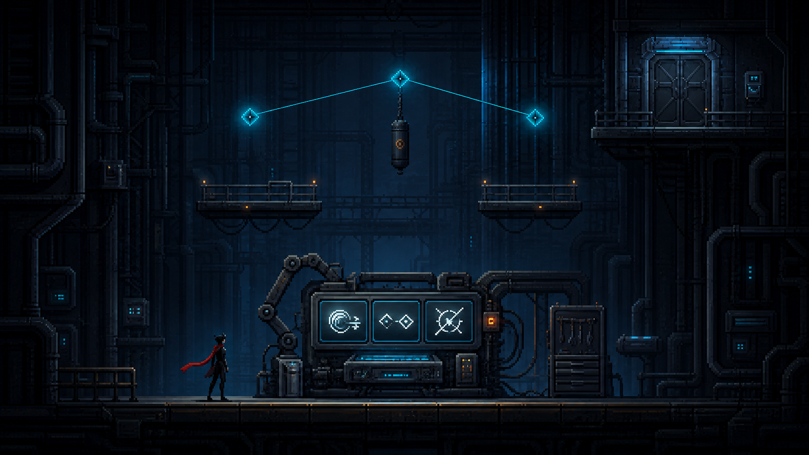
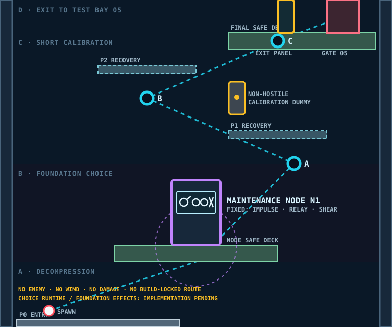

# SECTOR 01-4 — PRODUCTION ALIGNMENT

*FOUNDATION CHOICE · CALIBRATION · STORY HANDOFF · REV 1.1*

본 문서는 [1-4 시나리오](./README.md) REV 3.1을 현재 Runtime과 연결하는 제작 계약이다. 1-4의 첫 Foundation Augment 선택·저장·효과·개인별 멀티 동기화는 구현됐으며, 수치와 정식 표현 자산은 플레이테스트로 조정할 Prototype이다.

## 1. 현재 판정

| 항목 | 상태 | 판정 |
| --- | --- | --- |
| 768×640 Geometry | `IMPLEMENTED` | Node Deck, A→B→C, P1/P2 Recovery, Final Deck, Gate가 Area Catalog에 존재 |
| Maintenance Node 위치 | `IMPLEMENTED ALIGNMENT` | `(0,-160)` bottom-center로 Node Deck에 정렬, Interaction Radius 80 |
| Camera Zones | `IMPLEMENTED PROTOTYPE` | 문자열 Placeholder를 실제 Entry/Node/Calibration/Exit Shot 데이터로 교체 |
| 3개 고정 Choice 데이터 | `IMPLEMENTED` | 세 카드를 동시에 표시하고 좌우·기존 점프 Confirm·진입 Input Gate를 공용 Reward Selection으로 처리 |
| `interact-choice` 진행 | `IMPLEMENTED` | Node 상호작용은 개인 chooser를 열고 첫 확정이 공유 `augment-selected`를 완료해 Exit Panel을 활성화 |
| Foundation 저장·효과 | `IMPLEMENTED PROTOTYPE` | Player별 상태·snapshot·claim과 Release/Attach 기반 Impulse·Relay·Shear 효과 구현 |
| Node Story Presentation | `IMPLEMENTED` | 진입·Node Scan·선택 확정 사건을 계약 문구에 연결 |
| Calibration Dummy Feedback | `IMPLEMENTED PROTOTYPE` | Shear Release 교차를 한 번 판정하고 Spark·`CONTACT REGISTERED`를 표시 |
| `01_scenario_art_reference.png` | `TEMPORARY / PENDING REGENERATION` | Reward Room·Node·세 Profile 위계만 참고; Player 크기와 Anchor 연결 의미를 통일해 교체 |
| `02_approved_blockout.svg` | `APPROVED BLOCKOUT` | 현재 좌표, 통과 경로, Node, Dummy, Gate의 제작 기준 |
| 기본 `swingImpulse = 780` 이동 | `HYPOTHESIS` | 1-1·1-2 A/B/C 검증 전 Impulse 전용으로 이전 금지 |

Foundation 확정은 Calibration 성공 여부와 분리된다. 첫 개인 선택이 공용 Objective를 완료한 뒤 Exit Panel을 조작할 수 있고, Calibration Dummy는 효과 확인용일 뿐 Gate Key가 아니다. 두 번째 플레이어도 같은 Node에서 자기 선택을 별도로 확정하며 먼저 선택한 값을 복사하지 않는다.

## 2. 문서 이미지와 자료 우선순위

### Scenario Art Reference

`TEMPORARY / PENDING REGENERATION`: Node가 판타지 Shrine이 아니라 기업용 진단·수리 장비로 보이는지, 세 Profile이 색이 아닌 형태로 동등하게 읽히는지, 1-3보다 긴장이 낮은지만 참고한다. 큰 Player와 삼각 Anchor 연결은 새 이미지에 복제하지 않는다. Platform 위치는 물리 좌표가 아니다.

### Approved Blockout

1. Story 의미·Augment 철학·금지 요소는 [시나리오 README](./README.md)가 결정한다.
2. Foundation 공통 규칙은 [증강·Story 통합 기준](../AUGMENT-STORY-INTEGRATION.md)이 결정한다.
3. 좌표·Stable ID·Camera Shot은 `Sector01AreaCatalog.js`와 Approved Blockout이 함께 결정한다.
4. 현재 Art Reference는 조명과 일부 정보 위계만 임시 참고하며 Player 크기·Rope 연결·Camera 구도 기준으로 사용하지 않는다.
5. 선택 Runtime이 추가되면 이 문서의 `PENDING/BLOCKED`를 같은 변경에서 갱신한다.
6. 재생성은 [Scenario Art 생성 규격](../../SCENARIO-ART-GENERATION-STANDARD.md)과 그 시점의 선택 Runtime 구현 상태를 적용한다.

## 3. Runtime Geometry

좌표는 Stage Local World Unit이며 `X=-384~384`, `Y=0~-640`이다.

| ID | 위치 | 크기·속성 | 역할 |
| --- | --- | --- | --- |
| P0 | `(-192,0)` | 320×32 | Entry·Decompression |
| Node Deck | `(0,-160)` | 320×32, safe-deck | 선택 전후 안전 공간 |
| Node N1 | `(0,-160)` | bottom-center, radius 80 | Foundation 선택 Source |
| A | `(192,-320)` | 24×24 | Calibration 시작 |
| P1 | `(160,-384)` | 192×16, recovery | A 실패 Catch |
| B | `(-96,-448)` | 24×24 | Re-Attach 확인 |
| Dummy | `(80,-448)` | non-hostile, no damage | Shear Feedback Target |
| P2 | `(-96,-512)` | 192×16, recovery | B/C 실패 Catch |
| C | `(160,-560)` | 24×24 | Calibration 종료 |
| Final Deck | `(208,-576)` | 288×32, safe-deck | Panel·Gate |
| Exit Panel | `(176,-576)` | bottom-center | 선택 완료 뒤 Gate 조작 |
| Gate 05 | `(288,-576)` | bottom-center | 1-5 Test Bay 연결 |

모든 선택과 `foundationAugment = none` 상태에서도 A→B→C→Exit의 물리 이동은 가능해야 한다. 증강은 문을 여는 Key가 아니며 선택 Objective만 Story 진행 조건이다.

## 4. 첫 선택 흐름 계약

1. Player가 1-3의 `violation-logged` 이후 1-4에 진입한다.
2. Node가 `grapple-detected → telemetry-analyzed → override-available`을 짧게 표시한다.
3. Player가 Radius 80 안에서 Interact하면 개인별 Choice Overlay를 연다.
4. `Impulse Coil / Relay Link / Shear Current` 세 카드를 항상 동시에, 같은 강조도로 제시한다.
5. 좌우 입력으로 이동하고 기존 Confirm 입력으로 하나를 확정한다. 새 Gameplay Button은 추가하지 않는다.
6. 선택한 Player의 `foundationAugment`를 저장·복제하고 `augment-selected → firmware-applied`를 표시한다.
7. 해당 Player만 조작을 잠시 잠그며 멀티플레이 전체 Simulation을 Pause하지 않는다.
8. Input Gate로 Overlay 진입에 사용한 방향·확정 입력이 선택까지 중복 소비되지 않게 한다.

Artifact Overlay의 카드 배치와 Input Gate는 재사용할 수 있지만 `checkpointId`, Artifact Catalog, 자동사격 효과에 Foundation을 억지로 넣지 않는다. 공통 `RewardSource`가 `artifact` 또는 `augment`를 열도록 분리한다.

## 5. Foundation 행동 계약

| Choice | 정체성 | 첫 Runtime 계약 | 금지 |
| --- | --- | --- | --- |
| Impulse Coil | Momentum / Timing | 유효한 Swing 뒤 Release Event에서 조건부 운동량 변환 | 상시 Speed%, Damage%, 기본 780 즉시 제거 |
| Relay Link | Chaining / Rhythm | Release 뒤 짧은 Window, 다음 Attach 한 번의 Buffer·Aim 허용도만 확대 | 상시 Auto Aim, 자동 Anchor 선택, 과도한 Rope 거리 증가 |
| Shear Current | Geometry / Offense | Release 순간 Anchor–Player Segment와 Enemy Body 교차를 한 번 판정 | 매 Frame 전수 충돌, Projectile/Wall/Prop 절단, 자동 Swing Damage |

현재 Prototype은 Impulse 추가 Release 추진력 `180`, Relay Window `0.65초`, Attach Buffer `100ms → 160ms`, Aim Tolerance `90 → 108`, Shear Damage `20`을 사용한다. 이는 `PROTOTYPE`이며 1-2·1-5 기준 성공률과 전투 시간을 측정한 뒤 조정한다.

Impulse의 현재 `swingImpulse = 780` 소유권은 `HYPOTHESIS`다. 현재값·중간값·0의 A/B/C에서 1-1과 1-2의 기본 Rope가 재미와 통과 가능성을 유지한다는 증거 없이 Foundation으로 이전하지 않는다.

## 6. Calibration 계약

- 선택 확정 뒤 10초 안에 A를 사용할 수 있어야 한다.
- Impulse는 A Release의 거리·Arc Feedback을 보여준다.
- Relay는 A→B 연결에서 짧은 Pulse와 Attach 성공 Feedback을 보여준다.
- Shear는 Rope Segment가 Dummy를 가로지른 Release에서만 Spark와 `CONTACT REGISTERED`를 보여준다.
- Dummy는 공격하지 않고 Player Damage·Knockback·전투 음악을 만들지 않는다.
- 선택하지 않은 Foundation이나 기본 Rope로도 Recovery를 이용해 C와 Exit에 도달한다.
- Calibration 성공을 Gate Key로 만들지 않는다. Foundation 선택만 완료하면 Exit Panel이 활성화된다.

## 7. Story Trigger 계약

| EVENT | 조건 | 표시 의미 |
| --- | --- | --- |
| `grapple-detected` | 1-4 최초 진입 | `GRAPPLE DEVICE / DETECTED` |
| `telemetry-analyzed` | Node가 화면에 들어오고 짧은 Scan 완료 | `GRAPPLE TELEMETRY / ANALYZED` |
| `override-available` | 선택 Overlay 개방 가능 | `SAFETY LIMIT OVERRIDE / AVAILABLE` |
| `augment-selected` | 개인별 선택 확정 | `AUGMENT PROTOCOL / ACCEPTED` |
| `firmware-applied` | Player 상태 저장·복제 완료 | `[AUGMENT NAME] / ONLINE` |

1-3에서 기록된 `violation-logged` 때문에 Node가 Emergency Profile을 허용한다. 이 Stage에서는 Evacuation 차별, Lower Grid 포기, Shuttle 자격 같은 후반 정보를 공개하지 않는다.

## 8. Camera Shot 계약

| SHOT | Player local Y | 반드시 읽힐 대상 | Desktop | Mobile | Player screen Y ratio |
| --- | --- | --- | ---: | ---: | ---: |
| Entry | `0~-160` | Player, Node, Node Deck | 1.15 | 0.78 | 0.55 |
| Node | `-160~-320` | Player, Node Screen, A | 1.10 | 0.76 | 0.58 |
| Calibration | `-320~-576` | A/B/C, Dummy, P1/P2 | 0.95 | 0.70 | 0.62 |
| Exit | `-576~-640` | C, Final Deck, Panel, Gate 05 | 1.15 | 0.78 | 0.68 |

Choice Overlay 중에는 선택한 Player의 Camera만 Node 중심으로 고정하거나 이동 보간을 멈춘다. 큰 Cinematic Zoom과 전체 Simulation Pause는 사용하지 않는다.

## 9. 저비용 구현 순서

1. `FOUNDATION_AUGMENT_CATALOG`과 Player별 `foundationAugment` 상태를 만든다.
2. Artifact 카드·Input Gate를 재사용하는 범용 `RewardSource`를 만들되 Catalog와 결과 적용은 분리한다.
3. `interact-choice`가 개인 선택 완료 뒤 공용 Objective를 완료하도록 World Progress Event를 연결한다.
4. Foundation 상태와 선택 완료를 Snapshot·Checkpoint 정책에 명시적으로 포함한다.
5. Impulse·Relay·Shear를 기존 Attach/Release Event에만 연결한다.
6. Dummy Feedback과 Story Presentation을 Stable ID에 binding한다.

Physics Engine 교체, 새 Mode 버튼, 매 Frame Rope 충돌, Stage 전용 대형 배경, 증강별 별도 방은 만들지 않는다. Node·Gate·Dummy·Card는 공용 Atlas와 Overlay 레이아웃을 재사용한다.

## 10. Acceptance

- Node를 찾지 않고 지나칠 수 없으며 Entry Shot에서 Player와 함께 보인다.
- 세 Choice가 항상 고정 목록으로 동등하게 표시되고 60초 이내 선택 가능하다.
- 개인 선택 중 다른 Player의 이동과 Simulation은 계속된다.
- 선택 결과가 개인별로 저장·복제되고 같은 Player에게 Overlay가 중복 개방되지 않는다.
- 모든 Foundation과 기본 Rope로 A→B→C→Exit 통과가 가능하다.
- 선택 후 10초 안에 효과 Feedback을 확인하지만 Calibration 실패로 진행이 막히지 않는다.
- Foundation과 Artifact가 서로 다른 Catalog·획득 시점·효과 계층으로 읽힌다.
- `swingImpulse = 780` 변경은 별도 A/B/C 근거 없이는 포함하지 않는다.
- `01_scenario_art_reference.png`의 Platform 위치를 Runtime Collision으로 복제하지 않는다.
- Approved Blockout, Area Catalog, Camera Zone 중 하나만 단독으로 변경하지 않는다.
