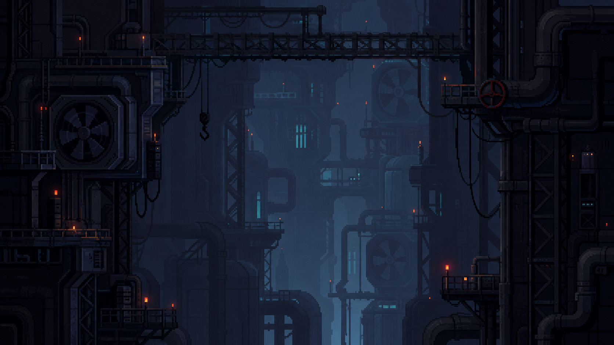

# SECTOR 01 — MAINTENANCE

> **CURRENT RUNTIME OVERRIDE — 0.32.0:** 1-1·1-2는 비전투를 유지하고 1-3 이후 authored slot 합계 16기를 사용한다. 1-3·1-6·1-7 Access 구역은 Carrier 포함 3기이며 정확한 pool/보존 계약은 [`../../../enemy-density-composition.md`](../../../enemy-density-composition.md)를 따른다.

*SHARED BACKGROUND ART REFERENCE · REV 1.1*

> 맵·시나리오·이미지·Runtime 수정 시 [Scenario Art 생성 규격](../SCENARIO-ART-GENERATION-STANDARD.md)과 [Sector 01 증강·스토리 통합 기준](./AUGMENT-STORY-INTEGRATION.md)을 함께 적용한다.

## 적용 범위

이 이미지는 `1-1`부터 `1-8`까지 이어지는 Sector 01 일반 구간의 공용 배경 아트 레퍼런스다. 전체 구간이 하나의 거대한 지하 정비 시설 안에 있다는 인상, 색과 조명, 공간의 깊이, 구조물 밀도를 정하는 기준으로 사용한다.

이미지 속 플랫폼이나 배관 위치를 그대로 레벨 지형으로 복제하지 않는다. 실제 이동 경로, 충돌, Anchor, Enemy, Wind, Recovery 배치는 각 Stage README의 Blockout 규격을 우선한다.

## 핵심 시각 방향

- Navy·Charcoal을 바탕으로 거대한 배관, 환풍기, 철골, Catwalk, 케이블이 겹친 산업 정비 시설을 만든다.
- 가까운 구조물은 거의 검은 실루엣, 플레이 공간은 어두운 청회색, 먼 구조물은 푸른 안개로 분리해 전경·중경·원경의 깊이를 만든다.
- 중앙에는 로프 궤적과 수직 상승을 읽을 수 있는 큰 여백을 남기고, 화면 가장자리의 무거운 구조물이 공간을 감싸게 한다.
- Cyan 설비등은 먼 깊이와 기술 설비를 암시하는 보조광으로 제한한다.
- Orange 경고등은 시설의 위험과 작동 지점을 표시하되 드물게 사용한다.
- 반복되는 대형 Fan과 Pipe는 Sector 01의 시각적 랜드마크로 사용한다.

## 게임플레이 가독성 규칙

- Player 실루엣과 Scarf, Cyan Rope·Anchor, Collision Edge, Red/Orange Telegraph는 항상 배경보다 먼저 읽혀야 한다.
- 배경의 Cyan은 Rope·Anchor보다 어둡고 채도가 낮아야 한다.
- 배경의 Orange/Red 점광원은 Sentry Telegraph나 Projectile의 진행 방향과 겹치지 않게 배치한다.
- 전경 구조물은 화면을 프레이밍할 수 있지만 Player, Anchor 후보, Recovery 발판을 가리면 안 된다.
- Fan, Valve, Cable 같은 장식이 상호작용 가능한 오브젝트처럼 보일 경우 Animation·Light·Collision 언어로 명확히 구분한다.
- Parallax는 깊이를 강화하는 수준으로 제한하고 Rope 조준과 빠른 수직 이동 중 목표 위치가 흔들려 보이지 않게 한다.

## Stage 문서

| Stage | 이름 | 핵심 역할 |
| --- | --- | --- |
| [1-1](./1-1/README.md) · [제작 정렬](./1-1/PRODUCTION-ALIGNMENT.md) | SERVICE SHAFT | 기본 Rope 오프닝 · 구조 정합 C04 Art Reference · 승인 Blockout |
| [1-2](./1-2/README.md) · [제작 정렬](./1-2/PRODUCTION-ALIGNMENT.md) | DOUBLE ANCHOR SHAFT | Airborne Re-Attach · 구조 정합 C02 Art Reference · 승인 Blockout |
| [1-3](./1-3/README.md) · [제작 정렬](./1-3/PRODUCTION-ALIGNMENT.md) | SECURITY CHECK | Sentry Telegraph·LOS · 구조 정합 Route Choice Art Reference · 승인 Blockout |
| [1-4](./1-4/README.md) · [제작 정렬](./1-4/PRODUCTION-ALIGNMENT.md) | MAINTENANCE NODE | 첫 Foundation 선택 · 구조 정합 Node Art Reference · 구현 정렬 |
| [1-5](./1-5/README.md) · [제작 정렬](./1-5/PRODUCTION-ALIGNMENT.md) | AUGMENT TEST BAY | Build Expression · Camera 구현 · 핵심 Story binding 구현 |
| [1-6](./1-6/README.md) · [제작 정렬](./1-6/PRODUCTION-ALIGNMENT.md) | COOLING SHAFT | Wind Shadow·Grounded 감쇠·Falloff·Camera 구현 · 핵심 Story binding 구현 |
| [1-7](./1-7/README.md) · [제작 정렬](./1-7/PRODUCTION-ALIGNMENT.md) | PRESSURE BYPASS | Rope·Build·Wind·Sentry 조합 · Camera와 핵심 Story binding 구현 |
| [1-8](./1-8/README.md) · [제작 정렬](./1-8/PRODUCTION-ALIGNMENT.md) | CONTAINMENT GATE | 일반 구간 최종 종합·Camera와 핵심 Story binding 구현 · Shutdown/정식 Prop 미구현 |

1-5~1-8의 Camera Zone과 핵심 Story binding은 [Camera/Story Implementation Handoff](./CAMERA-STORY-IMPLEMENTATION-HANDOFF.md)를 기준으로 Runtime에 반영됐다. Area의 `storyTriggers`는 시나리오 기획 인벤토리이며 구현 완료 근거가 아니다. 실제 표시는 `AuthoredStoryPresentation`의 area entry·position·`story-display` cue·objective/gate event binding이 소유한다.

1-1~1-3은 증강 없는 기본 Rope와 Telemetry 축적 구간, 1-4는 첫 Foundation Augment 선택, 1-5~1-8은 같은 공간을 선택한 증강에 따라 다르게 해석하는 검증 구간이다. Checkpoint는 진행 저장과 개인 부활만 소유하며 Foundation 선택은 authored Node에서 연다.

## 자산 상태

- 제공 이미지 크기: `1672 × 941 px`
- 저장 위치: `docs/bsh/scenario/1/images/sector-01-background-reference.png`
- 현재 용도: 기획·아트 방향을 맞추기 위한 문서용 레퍼런스
- 런타임 적용: 원본 출처, 사용권, 최종 제작 규격을 확인한 뒤 별도 환경 자산으로 전환한다.

Stage별 Scenario Art는 생성 직전에 해당 Stage Runtime과 Camera Zone을 다시 확인하고 보이는 발판·장애물의 구조 가이드를 먼저 만든다. 현재 1-1 C04 `05`, 1-2 C02 `06`, 1-3 Route Choice `05`, 1-4 Node `03` 이미지는 구조 관계까지 검수한 `APPROVED ART REFERENCE`다. 1-3의 이전 `03`은 `RETIRED / ROPE-ROUTE MISMATCH`로 이력만 보존한다. 1-5~1-8은 Approved Blockout 확정이 먼저다.

