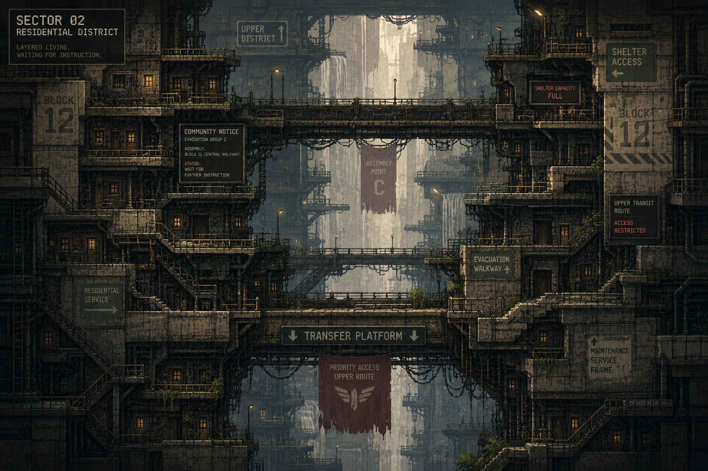

# SECTOR 02 — WORKER DISTRICT

> **CURRENT RUNTIME OVERRIDE — 0.32.0:** authored slot 합계 18기와 Patrol·Pursuit·Shield·Support·Artillery pool을 사용한다. Node chooser는 적 처치 없이 즉시 열리며 정확한 기준은 [`../../../enemy-density-composition.md`](../../../enemy-density-composition.md)를 따른다.

*MASTER PLAN v1*

`LEVELS 2-1–2-8` · `WORLD LEVELS 09–16` · `DIFFICULTY ★★ → ★★★★ SAWTOOTH` · `NEW ENEMY PATROL DRONE` · `NEW VARIABLE MOVING SECURITY PRESSURE` · `SECOND GENERIC AUGMENT @ 2-3`

## CURRENT RUNTIME OVERRIDE — 0.28.0

- 과거 Foundation 3종과 Foundation별 Specialization 계층은 `docs/augment-v1.md`의 22장 generic Catalog로 대체됐다.
- 2-3 Residential Service Node는 Player별 두 번째 결정적 3장 offer를 여는 명시적 source다. 특정 tier나 특정 카드 계열을 요구하지 않는다.
- 아래 `Foundation → Specialization` 명칭과 고정 계열 후보는 **AUTHORING SNAPSHOT — SUPERSEDED**다. 2-3의 Rest/Reward 위치, 공동 Service Room 공간·Story, 적·Hazard 없음과 이후 Build 표현 의도는 유지한다.

> 이 문서는 `2-1`~`2-8` 개별 스테이지 시나리오 문서가 아니라, Sector 02 전체를 관통하는 기획 요약본이다. 개별 스테이지 상세 스펙(좌표, Grid, Camera 등)은 각 `2-N/README.md`에서 다룬다.

Camera Zone은 8개 Stage README가 스스로 불필요하다고 명시하며(Level Geometry와 공용 기본 Camera로 구도 해결), Story Presentation의 공백은 [Story Implementation Handoff](./STORY-IMPLEMENTATION-HANDOFF.md)를 기준으로 Runtime에 반영됐다. 2-4는 entry 중심, 2-6은 최소 위치 표지만 의도적으로 사용하고, 2-8 Transfer Control은 Group A/B/C와 `PRIORITY ACCESS: ACTIVE`를 objective event에서 순서대로 표시한다.

## Contents

00. [Overview](#00--overview)
01. [Sector 02 한 줄 정의](#01--sector-02-한-줄-정의)
02. [Sector 02 Story Goal](#02--sector-02-story-goal)
03. [Story Question](#03--story-question)
04. [시각적 변화](#04--시각적-변화)
05. [Pixel Art 기준](#05--pixel-art-기준)
06. [Sector Gameplay Philosophy](#06--sector-gameplay-philosophy)
07. [Sector 02의 새 적 — PATROL DRONE](#07--sector-02의-새-적--patrol-drone)
08. [Patrol Drone 설계 원칙](#08--patrol-drone-설계-원칙)
09. [Patrol Drone 기본 FSM 후보](#09--patrol-drone-기본-fsm-후보)
10. [Drone의 핵심 목적](#10--drone의-핵심-목적)
11. [Sector 02 전체 난이도 구조](#11--sector-02-전체-난이도-구조)
12. [스테이지별 요약 (2-1 ~ 2-8)](#12--스테이지별-요약-2-1--2-8)
13. [Build Progression — Specialization](#13--build-progression--specialization)
14. [Sector 02 전체 Gameplay Progression](#14--sector-02-전체-gameplay-progression)
15. [Sector 02 전체 Story Progression](#15--sector-02-전체-story-progression)
16. [Sector 02 그래픽 구조](#16--sector-02-그래픽-구조)
17. [Background Density Rule](#17--background-density-rule)
18. [Architecture Rule](#18--architecture-rule)
19. [Player Scale](#19--player-scale)
20. [Patrol Drone Pixel Spec](#20--patrol-drone-pixel-spec)
21. [Patrol Drone Visual States](#21--patrol-drone-visual-states)
22. [Sector 02 사운드 변화](#22--sector-02-사운드-변화)
23. [Player Narrative Pursuit](#23--player-narrative-pursuit)
24. [Sector 02 전체 PASS Criteria](#24--sector-02-전체-pass-criteria)
25. [Sector 02에서 피해야 할 것](#25--sector-02에서-피해야-할-것)
26. [구현 순서](#26--구현-순서)
27. [Sector 02 Final Summary](#27--sector-02-final-summary)
28. [Sector 02 배경 아트 레퍼런스](#28--sector-02-배경-아트-레퍼런스)

---

## 00 · OVERVIEW

| 항목 | 내용 |
|---|---|
| Status | MASTER PLAN v1 |
| Levels | 2-1 ~ 2-8 |
| World Levels | 09 ~ 16 |
| Primary Theme | 사람이 살던 수직 노동자 주거구역을 통과하며 "사고 때문에 모두 사라진 것"처럼 보이던 상황이 점차 "누군가는 대피했고, 누군가는 기다리도록 남겨졌다"는 의문으로 발전한다 |
| Primary Gameplay Theme | MOVEMENT THROUGH LIVED-IN SPACE |
| Sector 01 대비 | 산업설비 속 Rope 학습 → 사람의 생활공간 속 Rope 응용 |
| New Major Gameplay Variable | MOVING SECURITY PRESSURE |
| Primary New Enemy | PATROL DRONE |
| Build Progression | First Specialization around 2-3 |
| Sector Difficulty | ★★ → ★★★★ sawtooth |

## 01 · SECTOR 02 한 줄 정의

Maintenance Sector를 빠져나온 정비기사가 사람들이 실제로 거주하던 Worker District를 지나며, 고정된 산업설비가 아니라 다음 사이를 Rope로 이동한다.

- Balcony
- Residential Bridge
- Apartment Exterior
- Laundry Line
- Utility Frame
- Shelter Access
- Community Platform

동시에 고정 Turret과 달리 공간을 이동하는 Patrol Drone이 등장하면서, 플레이어는 **"Anchor만 보는 것"**에서 **"Anchor + 움직이는 위협 + 이동경로"**를 함께 읽기 시작한다.

## 02 · SECTOR 02 STORY GOAL

### Sector 01에서 Player가 확인한 것

- Lower Maintenance가 실제로 Shutdown됨.
- LOWER GRID SUSPENSION이 실행됨.
- Worker District에 사람들이 거주한 흔적이 있음.
- EVACUATION GROUP C는 `WAIT FOR FURTHER INSTRUCTION` 상태였음.

### Sector 02에서 Player가 알아야 하는 것

1. Worker District에는 실제 가족과 노동자들이 살았다.
2. 대피 명령은 존재했다.
3. 모든 사람에게 같은 대피 절차가 적용된 것은 아니다.
4. 일부 Worker Group은 이동 허가를 기다렸다.
5. 위쪽으로 향하는 Transportation Access는 먼저 차단됐다.

그러나 아직 **"Lower Grid 사람들을 의도적으로 버렸다."**까지 확정하지 않는다. 그 진실은 Sector 4~5에서 완성한다.

## 03 · STORY QUESTION

| 시점 | 질문 |
|---|---|
| Sector 02 시작 | "사람들은 어디 갔지?" |
| Sector 02 종료 | "왜 이 사람들은 여기서 기다리고 있었지?" |

이 질문의 변화가 Sector 02 스토리의 핵심이다.

## 04 · 시각적 변화

| SECTOR 01 | SECTOR 02 |
|---|---|
| Steel | Apartment exterior |
| Pipe | Worker locker |
| Fan | Laundry |
| Valve | Canteen |
| Machinery | Balcony |
| Cold industrial lighting | Small plant / Personal signs / Children's drawing / Shift board / Shelter signage / Waiting area |

### Palette

- 기본: Dark Navy / Charcoal 유지
- 추가: Muted Warm Yellow, Muted Teal, Old Fluorescent Green
- Danger: Red / Orange
- Rope / Anchor: Cyan
- Player: Dark silhouette + Red Scarf

## 05 · PIXEL ART 기준

| ASSET | 규격 |
|---|---:|
| Base Grid | 32×32 px |
| Player | 48×48 px output |
| Human-scale Door | 64×96 ~ 64×128 px |
| Window | 32×32 / 64×32 px |
| Balcony | 96~256 × 16/32 px |
| Locker | 32×64 px |
| Bench | 64~96 × 32 px |
| Vending / Canteen | 64×96 px |
| Laundry Prop | 16×16 ~ 32×32 px |
| Patrol Drone | 24×24 ~ 32×32 px |
| Anchor | 24×24 px |
| Large Residential Module | 128×128 ~ 256×256 px |
| Far Background | 512×288 / 960×540 |

## 06 · SECTOR GAMEPLAY PHILOSOPHY

| Sector | 대표 공간 |
|---|---|
| Sector 01 | EMPTY INDUSTRIAL SHAFT |
| Sector 02 | OCCUPIED ARCHITECTURE |

Anchor를 단순히 공중에 배치하지 않고 다음과 같이 실제 건축 요소와 연결한다.

- Balcony underside
- Building frame
- Utility bridge
- Residential support
- Maintenance rail

단, 모든 Background Detail이 Grapple 가능한 것은 아니다. Gameplay Target은 여전히 명확해야 한다.

## 07 · SECTOR 02의 새 적 — PATROL DRONE

역할: 움직이는 Security Pressure.

| 적 | 위치 | Player가 읽어야 하는 것 |
|---|---|---|
| Turret | 고정 | Telegraph Timing |
| Drone | 계속 변함 | "언제 쏘지?" + "지금 어디에 있지?" |

## 08 · PATROL DRONE 설계 원칙

Patrol Drone은 Turret의 상위호환이 아니다.

| Turret 대비 | 방향 |
|---|---|
| 이동 가능 | ▲ |
| 작은 크기 | ▲ |
| 넓은 공간 압박 | ▲ |
| 공격력 | 동일/낮음 |
| Patrol Route | 명확 |
| 이동 속도 | 느림 |
| Telegraph | 명확 |
| 방향 전환 | 예측 가능 |

첫 Drone은 복잡한 AI 금지.

## 09 · PATROL DRONE 기본 FSM 후보

```text
PATROL
  ↓
PLAYER DETECTED
  ↓
ACQUIRE
  ↓
TRACK
  ↓
LOCK
  ↓
FIRE
  ↓
REPOSITION / PATROL
```

새 공격 패턴 없음. Projectile도 기본 Sentry 계열을 우선 재사용. Rope Cut: **NO**.

## 10 · DRONE의 핵심 목적

Drone을 죽이는 것이 목표가 아니다. Drone이 만드는 질문은 **"지금 어느 쪽 Route가 더 안전하지?"** — 즉 적이 Level Route Choice를 변화시킨다.

## 11 · SECTOR 02 전체 난이도 구조

```text
2-1 ★         TRANSITION / EXPLORATION
  ↓
2-2 ★★        FIRST PATROL DRONE
  ↓
2-3 REST      FIRST SPECIALIZATION
  ↓
2-4 ★★☆       MULTI-ROUTE RESIDENTIAL STACK
  ↓
2-5 ★★★       EVACUATION WALKWAY
  ↓
2-6 ★★☆       BREATH / ENVIRONMENTAL STORY
  ↓
2-7 ★★★☆      SHELTER ACCESS
  ↓
2-8 ★★★★      EVACUATION PLATFORM / SECTOR FINALE
```

난이도는 계속 상승하지 않는다. `2-3` Reward, `2-6` Story/Relief 뒤 다시 상승한다.

## 12 · 스테이지별 요약 (2-1 ~ 2-8)

| Stage | 이름 | Role | Difficulty | Enemy | New Mechanic |
|---|---|---|---|---|---|
| 2-1 | WORKER BLOCK 12 | Sector Transition / World Introduction | ★ | NONE | NONE |
| 2-2 | PATROL WALKWAY | First Moving Enemy | ★★ | 1 Patrol Drone | Patrol Drone |
| 2-3 | RESIDENTIAL SERVICE NODE | Rest / Reward | REST | NONE | First Specialization |
| 2-4 | RESIDENTIAL STACK | First Major Multi-Route Room | ★★☆ | 1 Patrol Drone | NONE |
| 2-5 | EVACUATION WALKWAY | Story Pressure + Gameplay Pressure | ★★★ | 1 Patrol Drone(상세 설계에서 확정 — 2-7의 2-Drone 순차 구조와 역할 중복을 피하기 위해 1대로 LOCK) | NONE |
| 2-6 | QUIET RESIDENTIAL VOID (working title: EMPTY COURTYARD) | Breath / Environmental Story | ★★☆ | NONE(상세 설계에서 확정 — Enemy 완전 배제로 LOCK) | NONE |
| 2-7 | SHELTER ACCESS | Sector Final Build-up | ★★★☆ | 2 Patrol Drone (순차/구역 분리) | NONE |
| 2-8 | EVACUATION PLATFORM | Sector 02 Finale | ★★★★ | 2 Patrol Drone (max) | NONE / Boss 없음 |

### 2-1 — WORKER BLOCK 12

**공간**: WORKER BLOCK 12, RESIDENTIAL COURTYARD. Apartment exterior, Balcony, Laundry, Exterior stair, Canteen window, Utility pipes, Vertical courtyard. Sector 01보다 짧은 높이 차이와 더 많은 수평 이동을 사용.

**Story**: Player가 보는 것 — 열린 Apartment door, 남겨진 작업복, 반쯤 먹은 식사, Laundry, Locker, 작은 화분, Shift schedule, Evacuation notice. 시체 없음, 큰 설명문 없음. 생활이 갑자기 중단됐다는 느낌만 전달.

핵심 Story Text:

> `COMMUNITY NOTICE`
>
> `EVACUATION GROUP C`
>
> `ASSEMBLY: BLOCK 12 CENTRAL WALKWAY`
>
> `STATUS: WAIT FOR FURTHER INSTRUCTION`

Player는 "대피하려고 모였구나." 정도만 이해.

**Gameplay**: 1-1처럼 Tutorial은 아니지만 Sector Transition이므로 쉬워야 한다.

```text
Balcony A → Anchor B → Residential Bridge → Anchor C → Upper Courtyard → Exit
```

Safe / Flow Route가 존재하지만 Enemy Pressure 없음.

### 2-2 — PATROL WALKWAY

**Primary Lesson**: "Enemy 위치도 이동경로의 일부다."

**공간**: 긴 Residential Exterior Walkway. 중앙에 큰 Open Courtyard. Drone은 좌↔우로 고정 Patrol Route를 이동. Player는 Drone 아래/위/뒤를 Rope로 통과할 수 있음.

**첫 Drone Tutorial**: Drone이 Player를 발견하기 전에 한 번 Patrol Cycle을 보여준다. Safe Platform에서 `LEFT → CENTER → RIGHT → TURN → LEFT` 사이클을 관찰한 뒤 Player 진입. 목표는 움직이는 적도 예측 가능하다는 것을 학습시키는 것.

**Route 구조**:

| Route | 방식 |
|---|---|
| SAFE | Drone이 멀어질 때 이동 |
| FLOW | Drone 아래를 빠르게 Rope Chain |
| SKILL | Drone 이동방향 반대쪽으로 Momentum을 이용해 지나감 |
| SHEAR | Rope Geometry가 맞으면 Drone 공격 가능 |

Drone Kill: **OPTIONAL**.

### 2-3 — RESIDENTIAL SERVICE NODE

**Story Context**: Worker District의 Residential Maintenance Office. 평상시 Elevator / Lighting / Ventilation / Residential utility 관리용 Node. Player Grapple가 다시 Scan됨.

> `FOUNDATION AUGMENT DETECTED`
>
> `ADVANCED COMPATIBILITY AVAILABLE`

첫 Specialization 선택. 상세는 [13 · Build Progression](#13--build-progression--specialization) 참고.

### 2-4 — RESIDENTIAL STACK

**Goal**: Vertical Housing Architecture를 여러 방식으로 읽는 경험.

**공간**: 거대한 주거동 외벽. 여러 층의 Balcony / Laundry platform / Utility bridge / Stair landing / Roof frame이 겹친다. 한 개의 중앙 Spine이 아니라 왼쪽 / 중앙 / 오른쪽 Route 존재.

| Route | 특징 |
|---|---|
| LEFT | Safe Residential Balconies — 가장 많은 Landing, 안전 |
| CENTRE | Fast Grapple Spine — 가장 빠름 |
| RIGHT | Drone / Build Opportunity — Augment 활용에 유리 |

세 Route는 중간에 다시 합류 가능. Lock-and-key 금지.

**핵심 경험**: Player가 "어느 Anchor가 정답이지?"가 아니라 **"나는 어느 길로 갈까?"**라고 생각해야 한다.

### 2-5 — EVACUATION WALKWAY

**Goal**: 대피 동선이 실제로 막혔다는 사실 발견.

**공간**: Worker District Central Evacuation Walkway. 원래 `Residential Block → Assembly Point → Upper Transit`으로 연결되는 Bridge였으나 현재 Upper Transit Gate `LOCKED`.

Story Evidence Display:

> `EVACUATION GROUP C`
>
> `ASSEMBLY COMPLETE`
>
> `TRANSFER AUTHORIZATION PENDING`
>
> `UPPER TRANSIT ACCESS RESTRICTED`

중요: 누가 왜 막았는지는 아직 없음.

Environmental Evidence: Waiting chairs, bags, blankets, water containers, abandoned queue barriers, children's items, worker ID tags, temporary shelter sign. Player가 "사람들이 여기까지 왔다."를 이해.

**Gameplay**: Evacuation Walkway 자체가 Drone Patrol Corridor가 됨. Safe Route(대기공간/구조물 뒤) · Flow Route(Walkway 아래/위 Grapple) · Build Route(Augment 활용). Story 공간과 Gameplay 공간을 따로 분리하지 않는다.

### 2-6 — QUIET RESIDENTIAL VOID (working title: EMPTY COURTYARD)

**Purpose**: 2-5의 Gameplay/Story 압박 뒤 짧은 해소.

**공간**: 높고 넓은 Residential Courtyard. 이전보다 큰 Negative Space, 적은 Platform, 멀리 보이는 여러 주거층, 수백 개의 꺼진 창문. Rope는 큰 Arc 위주.

**Story**: 대사나 Terminal보다 공간 자체가 Story. 멀리 같은 구조의 Worker Housing이 수직으로 수십 층 반복. 일부는 전력 없음, 일부는 Emergency light. Player가 처음으로 "이 구역에 사람이 정말 많았겠다."는 규모감을 느끼게 함.

Sector 02가 단순 Cyberpunk Apartment 몇 채가 아니라 도시 하부 노동자 계층 전체를 수용하는 거대한 Vertical Residential System임을 보여주는 방. Gameplay 난이도는 잠깐 낮춤.

### 2-7 — SHELTER ACCESS

**Goal**: Multi-route + Drone + Specialized Build 종합.

**Story**: Player가 Worker Shelter Access에 도달.

> `SHELTER CAPACITY FULL`
>
> `EVACUATION TRANSFER SUSPENDED`
>
> `REMAIN IN DESIGNATED AREA`

여기서 처음 `SUSPENDED`가 사람 대피 절차에도 사용됨. 하지만 아직 이유 없음.

**Gameplay Structure**:

| 구간 | 내용 |
|---|---|
| LOWER | Drone 1 + Multi-route |
| MID | Safe Shelter Deck |
| UPPER | Drone 2 + Build Expression |

두 Drone Crossfire 금지. 각각 다른 공간을 담당. Sector 1-8의 순차 Sentry 철학을 발전시킨 구조.

### 2-8 — EVACUATION PLATFORM (SECTOR FINALE)

Primary Gameplay: Patrol Drone + Multi-Route + Build Synthesis. Boss: **NONE**. Checkpoint: SECTOR-END CHECKPOINT.

**공간**: 대형 Worker Evacuation Transfer Platform. 원래 `Workers → Lift/Transit → Upper District` 대피용이었으나 현재 Transit empty, Boarding gates closed, Emergency lights active.

**Gameplay Climax**: Player는 거대한 Evacuation Atrium을 올라간다.

| Layer | 내용 |
|---|---|
| SAFE | Waiting platform / cover / balconies |
| FLOW | Atrium 중앙 Grapple chain |
| BUILD | Drone position과 Augment를 이용한 공격적/빠른 Route |

**Final Story Interaction** — 상단 Transfer Control 도달 시:

> `EVACUATION GROUP A — TRANSFER COMPLETE`
>
> `EVACUATION GROUP B — TRANSFER COMPLETE`
>
> `EVACUATION GROUP C — TRANSFER SUSPENDED`

이 메시지가 Sector 02의 Story climax다.

**매우 중요한 표현 규칙**: 아직 `GROUP A = 부자`, `GROUP B = 상류층`, `GROUP C = 노동자`라고 직접 설명하지 않는다. Player가 아는 것은 자신이 있는 Worker District가 Group C였다는 것, 그리고 A/B는 이동 완료했고 C는 정지했다는 차이뿐이다.

추가 Message:

> `UPPER TRANSIT ROUTE`
>
> `PRIORITY ACCESS: ACTIVE`

누가 Priority인지는 아직 공개하지 않는다. 이 내용은 Sector 03 Commercial District에서 이어진다.

**Ending Image**: Player가 Evacuation Platform 상단에 도달. 아래는 어두운 Worker Housing, 위는 밝고 화려한 Commercial District의 광고/Neon/Atrium Glow가 처음 보임.

| | WORKER | COMMERCIAL |
|---|---|---|
| 인상 | warm but dim / lived-in / worn | bright / polished / empty |

Player가 "위쪽은 전력이 살아 있다."는 사실을 텍스트보다 먼저 본다.

**Sector 02 → Sector 03 Transition**: Gate `COMMERCIAL TRANSFER SERVICE ACCESS`. Player Maintenance Override. Override는 매번 큰 Story Event가 아니라 주인공의 기본 능력으로 취급하며 긴 연출 없음.

**Sector 02 Checkpoint**: 2-8 종료 후 Checkpoint 활성. Foundation `KEEP`, Specialization `KEEP` — 다음 Sector에서도 Build 유지. 새 Augment는 2-8에서 주지 않음.

## 13 · BUILD PROGRESSION — SPECIALIZATION

| Sector | 단계 |
|---|---|
| 1-4 | Foundation 선택 |
| 2-3 | Foundation 심화 (Specialization) |

즉 Build가 "무슨 계열인가"에서 "그 계열 안에서 어떤 방식인가"로 발전한다.

### IMPULSE 계열

- Foundation(확정): `IMPULSE COIL`
- Specialization 후보: `OVERCHARGE` (더 큰 Commitment / Burst), `AFTERBURN` (Release 이후 Momentum 활용)
- Utility 후보: `TENSION GUARD` (Rope Defense)

정확한 3-choice 구성은 2-3 상세 설계에서 확정.

### RELAY 계열

- Foundation(확정): `RELAY LINK`
- 확정 방향: `HANDOFF` (연속 Grapple 강화)
- 나머지 선택지는 2-3 상세 기획에서 확정. **아직 OPEN — 억지로 이름부터 만들지 않는다.**

### SHEAR 계열

- Foundation(확정): `SHEAR CURRENT`
- Specialization 후보: `TRACE`, `CHAIN CUT`
- Utility 후보: `TENSION GUARD`

정확한 효과는 2-3 상세 설계에서 확정.

### Build Rule

2-3에서 얻는 Specialization은 Sector가 끝나도 유지된다. 1-4 Foundation도 유지된다.

```text
Run Build = FOUNDATION + SPECIALIZATION
```

이 상태로 Sector 3에 진입한다.

## 14 · SECTOR 02 전체 GAMEPLAY PROGRESSION

```text
2-1  SPACE LANGUAGE        "사람이 살던 공간에서도 Rope."
  ↓
2-2  MOVING THREAT         "적 위치도 움직인다."
  ↓
2-3  SPECIALIZATION        "내 Build가 더 구체화된다."
  ↓
2-4  ROUTE CHOICE          "정답 Anchor가 아니라 선택 Route."
  ↓
2-5  ROUTE + STORY PRESSURE "대피 동선 자체가 Gameplay 공간."
  ↓
2-6  SCALE / RELIEF        "이곳에 정말 많은 사람이 살았다."
  ↓
2-7  BUILD SYNTHESIS       "Drone + Route + Build."
  ↓
2-8  SECTOR FINALE         "내 Build로 Evacuation Platform을 돌파."
```

## 15 · SECTOR 02 전체 STORY PROGRESSION

```text
2-1  사람이 살았다.
  ↓
2-2  보안 시스템은 여전히 작동한다.
  ↓
2-3  Maintenance network를 계속 이용.
  ↓
2-4  Worker District의 거대한 주거 규모 확인.
  ↓
2-5  Group C가 Assembly Point까지 왔음.
  ↓
2-6  주거 인구의 규모 체감.
  ↓
2-7  Transfer가 "Suspended"됨을 확인.
  ↓
2-8  A/B = TRANSFER COMPLETE, C = TRANSFER SUSPENDED
```

Sector 종료 질문: **"왜 C만 멈췄지?"**

## 16 · SECTOR 02 그래픽 구조

| Layer | 구성 |
|---|---|
| Foreground Gameplay | balcony, catwalk, anchor, bridge, drone, cover |
| Near Background (32~64px) | window, locker, door, chair, plant, pipes, sign |
| Mid Background (128~256px) | apartment module, canteen, housing block, utility bridge, stair tower |
| Far Background (512×288 / 960×540) | repeating vertical housing blocks, distant windows, community towers, deep city void |

## 17 · BACKGROUND DENSITY RULE

Sector 01보다 생활 Prop 수는 증가한다. 하지만 Gameplay Anchor 주변은 여전히 Clean Zone을 유지한다. 특히 Laundry / Wire / Pipe가 Rope처럼 보여서는 안 된다.

> **IMPORTANT**
> Background clothesline / cable의 색을 Cyan으로 만들지 않는다.

## 18 · ARCHITECTURE RULE

Worker District는 현대 아파트처럼 넓은 평면이 아니다. 거대한 Mega-Structure 안쪽에 노동자 주거 모듈이 적층된 형태다.

핵심: `VERTICAL` · `DENSE` · `MODULAR` · `WORN` · `LIVED-IN`

## 19 · PLAYER SCALE

| 대상 | 크기 |
|---|---:|
| Player | 48×48 |
| Apartment Door | 약 64×96 이상 |
| Housing Block component | 128~256px |
| Far Residential Structure | 수백 px |

`SMALL HUMAN + HUGE CITY` 스케일을 계속 유지한다.

## 20 · PATROL DRONE PIXEL SPEC

- Visual: 24×24 ~ 32×32 px, Player보다 작거나 비슷
- Silhouette: compact body, horizontal patrol orientation, small sensor, short weapon barrel
- Color: Dark body / Sensor·Telegraph는 Red/Orange. **Cyan 사용 금지.**

## 21 · PATROL DRONE VISUAL STATES

| State | 표현 |
|---|---|
| PATROL | neutral silhouette |
| ACQUIRE | sensor active |
| TRACK | thin red aim indicator |
| LOCK | brighter sensor / fixed barrel |
| FIRE | small muzzle flash |
| TURN | body visibly flips / rotates |

색만으로 상태 구분 금지.

## 22 · SECTOR 02 사운드 변화

| SECTOR 01 | SECTOR 02 |
|---|---|
| machine | distant ventilation |
| fan | fluorescent buzz |
| pressure | residential electrical hum |
| metal | loose laundry / metal railing, vending machine, abandoned public announcement, distant city noise |

사람 목소리를 Background chatter로 넣는 것은 권장하지 않음. 현재 구역의 공백이 중요하다.

## 23 · PLAYER NARRATIVE PURSUIT

Global Timer 없음. 대신 Player가 올라갈수록 아래 Sector 상태가 변화한다. Sector 02에서도 뒤쪽 Worker Housing의 Emergency Lights가 일부 꺼지는 식으로 Containment가 따라오고 있다는 느낌을 유지한다. 하지만 실제 Countdown UI는 없음.

## 24 · SECTOR 02 전체 PASS CRITERIA

| PASS | 기준 |
|---|---|
| 01 | Sector 01과 공간 인상이 즉시 다름 |
| 02 | 사람이 살던 공간이라는 것이 설명 없이 읽힘 |
| 03 | Rope Gameplay 판독성은 유지 |
| 04 | 2-2 Drone이 Turret과 다른 압박을 만듦 |
| 05 | Drone 이동이 예측 가능 |
| 06 | Drone Kill이 필수 아님 |
| 07 | 2-3 Specialization이 Build 정체성을 강화 |
| 08 | 2-4부터 Route Choice가 명확해짐 |
| 09 | Safe / Flow / Build Route가 공존 |
| 10 | 2-5 Story Evidence가 Gameplay Flow를 방해하지 않음 |
| 11 | 2-6에서 감정 / 난이도 Breath가 존재 |
| 12 | 2-7에서 Specialization 사용 가치가 느껴짐 |
| 13 | 2-8 Finale가 새 Boss 없이 충분히 강함 |
| 14 | A/B Complete, C Suspended 정보가 기억에 남음 |
| 15 | Sector 03을 보고 위쪽 세계가 궁금해짐 |

## 25 · SECTOR 02에서 피해야 할 것

> **DO NOT**
>
> - Living NPC를 바로 많이 등장시킴
> - Corpses로 감정 강요
> - Family rescue subplot
> - Group C가 버려졌다고 직접 설명
> - Commercial Elite 정보를 벌써 공개
> - Drone을 무작위 이동 AI로 만듦
> - Drone을 Turret보다 모든 면에서 강하게 만듦
> - Rope Cut 추가
> - Moving Platform 추가
> - 새 환경 Force 추가
> - 2-3 외에 추가 Augment Node 남발
> - 각 Route를 Augment 전용 Door처럼 만듦
> - Background Laundry / Cable이 Grapple Anchor처럼 보이게 함

## 26 · 구현 순서

1. 2-1 Residential Greybox
2. Sector 02 environment kit
3. Patrol Drone movement prototype
4. Drone Telegraph
5. 2-2 first Drone encounter
6. 2-3 specialization system
7. 2-4 Multi-route authoring
8. 2-5 Evacuation Walkway
9. 2-6 Residential scale room
10. 2-7 synthesis
11. 2-8 finale / checkpoint
12. Story props / signage / background art

## 27 · SECTOR 02 FINAL SUMMARY

Sector 02의 핵심은 "새로운 Rope 능력"이 아니다. Sector 01에서 익힌 Rope를 사람이 살던 공간 + 움직이는 적 + 여러 이동경로 + 깊어진 Build 속에서 사용하는 것이다.

**Gameplay 변화**

```text
STATIC THREAT   → MOVING THREAT
LINEAR ASCENT   → ROUTE CHOICE
FOUNDATION      → SPECIALIZATION
```

**Story 변화**

```text
"사람들이 사라졌다."
  →
"사람들은 대피를 기다렸다."
  →
"A/B는 이동했지만 C는 멈췄다."
```

Sector 마지막에 Player가 가져야 할 질문은 **"왜 이 구역 사람들만 위로 올라가지 못한 거지?"** — 이 질문을 들고 SECTOR 03 COMMERCIAL로 진입한다.

---

## 28 · SECTOR 02 배경 아트 레퍼런스



### 적용 범위

이 이미지는 `2-1`부터 `2-8`까지 이어지는 Sector 02 Worker District 전체의 공용 배경 아트 레퍼런스다. 노동자 주거 구역이 수직으로 겹겹이 쌓인 인상, 색과 조명, Community Notice·Shelter Access·Evacuation Walkway·Transfer Platform 같은 반복 표지판의 정보 밀도, 공간의 깊이를 정하는 기준으로 사용한다.

이미지 속 다리·발판·표지판 배치를 그대로 레벨 지형으로 복제하지 않는다. 실제 이동 경로, 충돌, Anchor, Patrol Drone, Recovery 배치는 각 Stage README의 Blockout 규격을 우선한다.

### 핵심 시각 방향

- Dark Navy·Charcoal을 바탕으로 반복되는 Housing Module, 다리, 배관, 체인이 겹친 노동자 주거 구조물을 만든다.
- 중앙에 크고 밝은 Vertical Void(폭포/역광)를 두어 Rope 이동 궤적을 위한 여백과 수직 깊이를 동시에 확보한다.
- Community Notice, Shelter Capacity, Evacuation Walkway, Upper Transit, Priority Access 같은 표지판·배너는 Sector 02 Story Beat(2-1 Community Notice → 2-5/2-7 Evacuation·Shelter 상태 → 2-8 Priority Access)를 한 이미지 안에 압축해서 보여주는 참고 자료다. 개별 Stage에서 정확히 같은 문구·순서로 재현할 필요는 없다.
- Cyan은 Rope·Anchor 언어로 보호하고, 배경 표지판·배너의 정보색(White/Red/Warm)이 Cyan과 경쟁하지 않게 배치한다.
- 창문 조명 같은 작은 온기(Warm Yellow)를 낮은 밀도로 남겨 "사람이 살았던 공간"이라는 인상을 유지한다.

### 자산 상태

- 제공 이미지 크기: `1536 × 1024 px`
- 저장 위치: `docs/bsh/scenario/2/images/sector-02-background-reference.png`
- 현재 용도: 기획·아트 방향을 맞추기 위한 문서용 레퍼런스
- 런타임 적용: 원본 출처, 사용권, 최종 제작 규격을 확인한 뒤 별도 환경 자산으로 전환한다.

---

SECTOR 02 / WORKER DISTRICT — MASTER PLAN v1
